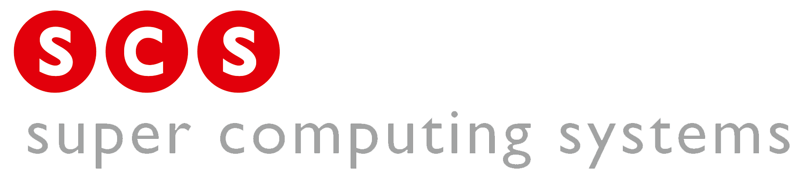

jumpstart-docs
==============

  
  
  

Die SCS Jumpstart-Kurse bieten einen effizienten Einstieg in den praktischen Alltag eines Entwicklers.

Dieses Repo beinhaltet unter [Topics](topics) alle Unterlagen der unterschiedlichen Kurse.
Die generierten PDFs und der Code können als Artefakt des Releases heruntergeladen werden:
[Latest release](https://github.com/scs/jumpstart-docs/releases/latest)

Die benötigten Tools und Accounts um am Kurs teilzunehmen sind unter
[Vorbereitung](topics/admin/introduction.md#vorbereitung) aufgelistet.
Die dazugehörige Entwicklungsumgebung ist hier dokumentiert: [jumpstart-vm](https://github.com/scs/jumpstart-vm)

Contributing
-------------

Die Unterlagen sind in `markdown` (und `latex`) geschrieben
und werden mithilfe von `pandoc` und weiteren Tools zu PDFs kompiliert.
[docmake](https://github.com/langchr86/docmake) hilft mit der Integration in cmake.

Falls externe Ressourcen verwendet werden, müssen diese korrekt zitiert werden.
Es sind nur externe Ressourcen (z.B. Bilder) mit einer Creative Commons Lizenz erlaubt.
Die korrekte Zitierung ist hier beschrieben: [Creative Commons - Use & Remix](https://creativecommons.org/use-remix/)
