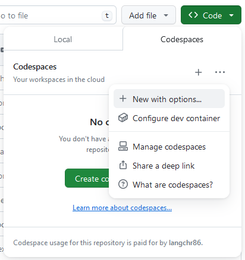
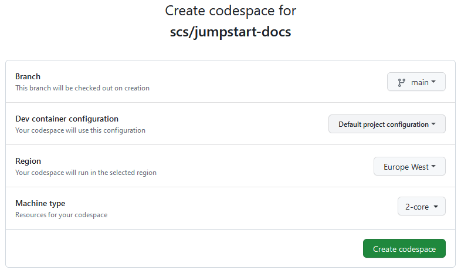
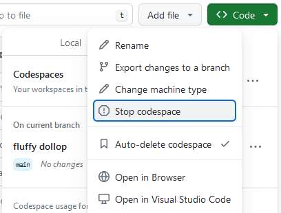

<#include meta/slides.md>

---
title: "Jumpstart - Codespaces"
---

Entwicklungsumgebungen in der Cloud
===================================

Wir verwenden Github Codespaces als schnelle und flexible Entwicklungs-Umgebung.
Diese bietet eine VM in der Cloud, auf welcher Visual Studio Code läuft
und automatisch einen [DevContainer](https://containers.dev/) startet.
Im `jumpstart-docs` Repo sind bereits diverse solcher DevContainer vorkonfiguriert.

Bei den Übungen kann man jeweils einen der gewünschten DevContainer starten.
Dies startet dann für den aktiven Github-User eine Instanz und verbindet sie.
Der schnellste Weg führt über folgenden Link:
[Create codespace for scs/jumpstart-docs](https://github.com/codespaces/new?hide_repo_select=true&ref=main&repo=351816701&skip_quickstart=true),
kann aber auch manuell ausgelöst werden mit:

Im folgenden Screen kann die DevContainer Config ausgewählt werden:

Nun kann im aktiven Codespace direkt gearbeitet werden.

Wichtig
-------

Pro User hat man nur begrenzte Gratisstunden pro Monat verfügbar.
Deshalb die Codespaces immer stoppen, wenn momentan nicht benötigt:

Dabei bleiben alle Daten erhalten
und der Codespace kann z.B. am nächsten Tag erneut gestartet und verbunden werden.
Wenn gar nicht mehr benötigt kann er explizit gelöscht werden.
Ansonsten wird er nach einer bestimmten Stop-Dauer (default 30 Tage) automatisch gelöscht.
