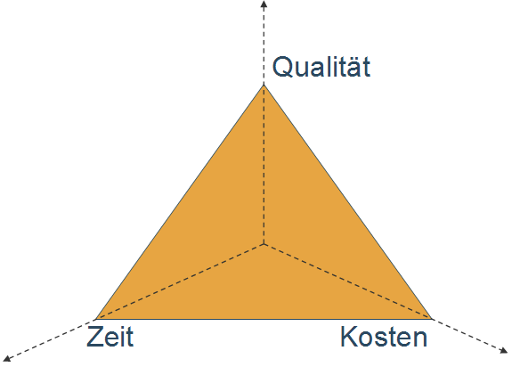

<#include meta/slides.md>

---
title: "Jumpstart - Einführung"
---

Über uns
--------

*Christian Lang*

* [christian.lang@scs.ch](mailto:christian.lang@scs.ch)
* Jahrgang 1986
* gelernter Elektroniker
* Studium: Informatik Bachelor und Master (MSE) an FHNW
* SCS seit 2014
  * High-Performance Abteilung
* Spezialgebiete:
  * Embedded Plattformen
  * Linux
  * C++
  * Optimierung

Über uns
--------

*Lucius Bachmann*

* [lucius.bachmann@scs.ch](mailto:lucius.bachmann@scs.ch)
* Jahrgang 1992
* Studium: Bachelor in Medienwissenschaft und Informatik
* SCS seit 2017
  * Software Solutions Abteilung
* Spezialgebiete:
  * Java
  * PHP
  * Datenbanken

Über uns
--------

*Luzian Bieri*

* [luzian.bieri@scs.ch](mailto:luzian.bieri@scs.ch)
* Jahrgang 1998
* Studium: Master in Robotics, Systems and Control
* SCS seit 2023
  * AI & Robotics Abteilung
* Spezialgebiete:
  * Linux/Yocto
  * Rust/C++
  * Robotics

Disclaimer
----------

Dieser Kurs zeigt keine absoluten Wahrheiten, sondern soll:

* *sensibilisieren*
* *Konzepte* vermitteln
* *Beispiele* vorstellen

Generell gilt, dass Bekanntes *je nach Projekt* neu bewerten werden muss.
Dabei spielen diverse Faktoren eine Rolle:

\centering
{width=40%}

\tiny
[PM Dreieck.png](https://de.m.wikipedia.org/wiki/Datei:PM_Dreieck.png)
by Konrad Krafft
licensed under [CC BY-SA 3.0](https://creativecommons.org/licenses/by-sa/3.0)

Ablauf
------

\colBegin{0.5}

* Mehrere *Themen*
* Pro Thema ein oder zwei *Blöcke*
* Ein Block ist *4 Stunden*
* Teilt sich auf in *Frontalunterricht* und *gemeinsame Übungen*
  $\break \rightarrow$ je nach Bedarf

\colNext{0.5}

\centering

\colEnd

Tools
-----

### Vorbereitung

* [GitHub-Account](https://github.com/signup)
* [DockerHub-Account](https://hub.docker.com/signup)
* Privaten [Bitbucket-Account](https://bitbucket.org/) (Nicht der SCS oder Studenten-Account)(inkl. 2-Faktor-Athentifizierung)
* Laptop (je nachdem zu zweit)
