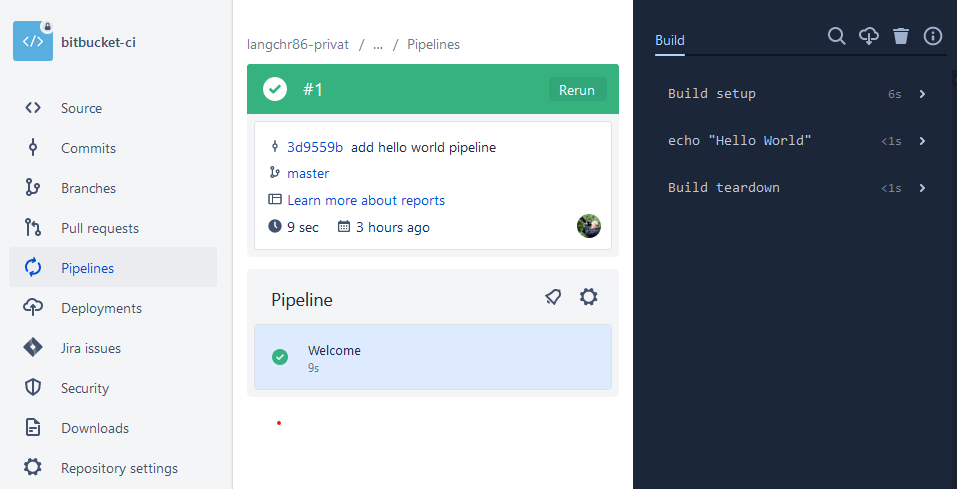
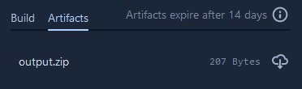
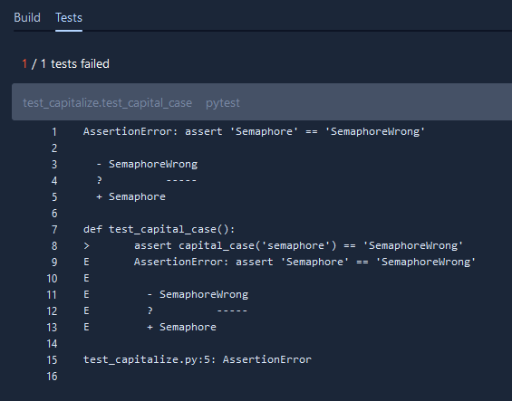
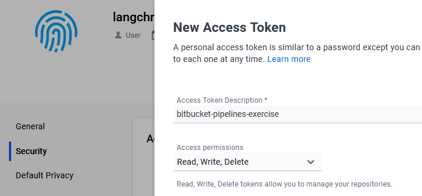
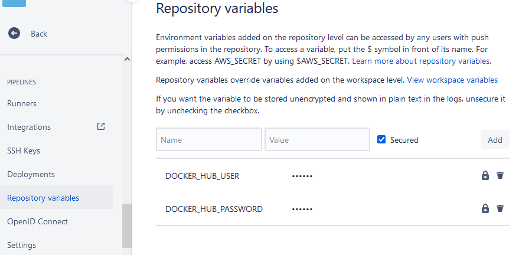

<#include meta/exercise.md>

---
title: "Arbeitsblatt: Bitbucket Pipelines"
---

Einleitung
==========

In dieser Übung werden wir eine einfache Bitbucket Pipeline aufsetzten,
welche automatisch z.B. CI/CD Aufgaben ausführen kann.
Solche Pipelines laufen per Default in der Cloud bei Atlassian,
können aber auch auf selbst-gehosteten Servern laufen.
In der SCS verwenden wir nur solche self-hosted Runners.
Für Übungszwecke verwenden wir aber nur Cloud-Funktionen.

Vorbereitung
============

Als Erstes wird ein privater Atlassian Account für Bitbucket benötigt.
Diesen kann man z.B. unter [bitbucket.org](https://bitbucket.org/) erstellen.
Falls im Browser bereits ein anderer Atlassian Account eingeloggt ist,
kann ein "Inkognito" oder "privates" Fenster verwendet werden,
um sich beim bestehenden Account nicht abmelden zu müssen.

Danach kann über den Button `Create` ein neues Repository erstellt werden.
Dazu muss auch ein Workspace und ein Projekt definiert werden.
Als Workspace kann z.B. `<user>-privat` und als Projekt `Jumpstart` verwendet werden.
Das Repository kann z.B. `bitbucket-pipelines-exercise` genannt werden.

Für die folgenden Aufgaben müssen nicht alzu viele Dateien erstellt/editiert werden.
Dies kann direkt über das Web-UI von Bitbucket gemacht werden.

Repo lokal klonen (optional)
----------------------------

Falls das Repo lokal bearbeitet werden soll,
sollte man unter [bitbucket.org/account/settings/ssh-keys](https://bitbucket.org/account/settings/ssh-keys/)
seinen public Key registrieren.

Danach kann das neue Repository geklont werden:

~~~
git clone https://<user>@bitbucket.org/<user>-privat/bitbucket-pipelines-exercise.git
# oder
git clone git@bitbucket.org:<user>-privat/bitbucket-pipelines-exercise.git
~~~

Wenn folgender Fehler beim Versuch mittels SSH auftritt:

~~~
Cloning into 'bitbucket-pipelines-exercise'...
The requested repository either does not exist or you do not have access.
~~~

kann es sein, dass der Authentication Agent (z.B. `pageant`) mehrere Keys verwaltet,
welche bei Bitbucket registriert sind.
In diesem Fall muss sichergestellt werden,
dass der gewünschte private Key der einzige oder der erste verwaltete Key ist.

Erste Automation mit Pipelines
==============================

Mittels CI/CD-Automatismen kann man diverse Probleme lösen.
Ein üblicher Task, welcher vor jedem Merge eines Pull-Requests durchgeführt werden soll,
ist üblicherweise das komplette Kompilieren und Ausführen der Tests des Projektes.

Da solche Automatismen stark mit dem eigentlichen Projekt-Code verbunden sind,
werden diese Pipelines ebenfalls im Projekt-Repo definiert und sind somit konsistent versionierbar.
In Bitbucket werden die Pipelines in der Datei `bitbucket-pipelines.yml` im Top-Level-Ordner des Repositories definiert.

Aufgabe
-------

* Erstelle im neuen Repo die Datei `bitbucket-pipelines.yml`.
* Definiere einen einzelnen "Step" der `Hello World` im Log ausgibt und bei jedem Pushen auf jedem Branch getriggert wird.
* Verwende das Ubuntu 22.04 image von Atlassian.
* Commite und pushe den neuen Stand und beobachte die Ausführung.

Die Pipeline kann links im Menu `Pipelines` ausgewählt werden.
Initial muss evtl. noch 2FA für den Atlassian-Account aktiviert werden.
Danach kann man mittels `Run initial pipeline` die Ausführung der Pipeline starten.

Lösung
------

Die `bitbucket-pipelines.yml` sollte etwa folgendermassen aussehen:

~~~{.yaml}
pipelines:
  default:                                  # no filtering for branch or PR-only
    - step:                                 # first in a list of steps
        name: 'Welcome'
        image: atlassian/default-image:4    # docker image to use: ubuntu 22.04 LTS
        script:                             # list of shell commands to execute
          - echo "Hello World"
~~~

Siehe auch:

* [use-docker-images-as-build-environments/#Default-build-environment](https://support.atlassian.com/bitbucket-cloud/docs/use-docker-images-as-build-environments/#Default-build-environment)
* [view-your-pipeline](https://support.atlassian.com/bitbucket-cloud/docs/view-your-pipeline/)

Pipeline mit mehreren "Steps"
=============================

In unserer ersten Pipeline haben wir einen einzelnen "Step" definiert,
welcher einen einzelnen Befehl ausgeführt hat.

"Pipelines" haben "Steps". Und "Steps" haben "Scripts" (Befehle).

Jeder Step ist in der Pipeline komplett unabhängig von anderen Steps.
Dazu läuft jeder Step in einem eigenen, neuen Container, welcher durch das `image` definiert wird.
Innerhalb des Step können aber beliebig viele Befehle ausgeführt werden,
welche auf den gemeinsamen Stand des aktuellen Containers zugreifen können.
So könnte durchaus in einem ersten Befehl eine Source-Datei erzeugt werden,
welche in einem zweiten Befehl als Input für den Kompiler dienen würde.

Aufgabe
-------

Als Nächstes wollen wir mehrere Steps aufeinander aufbauen lassen.
Dazu soll im ersten Step eine Datei generiert werden,
welche als sogenanntes "Artifact" an den zweiten Step übergeben wird.
Und dies, obwohl der zweite Step in einem völlig neuen Container läuft.

Lösung
------

Wir erzeugen in einem ersten Step die Datei `input.txt`.
Diese soll in einem weiteren Step mittels `zip` komprimiert werden.
Die resultierende `output.zip` Datei soll dann zusätzlich über des Web-UI herunterladbar sein.

Dazu ersetzten wir die Steps im `bitbucket-pipelines.yml` durch:

~~~{.yaml}
pipelines:
  default:
    - step:
        name: 'Generate'
        image: debian:bookworm
        script:
          - echo "My specific text" >> input.txt
        artifacts:
          - input.txt
    - step:
        name: 'Compress'
        image: ubuntu:jammy
        script:
          - apt update && apt install -y zip
          - zip output.zip input.txt
        artifacts:
          - output.zip
~~~

Diese nutzt nun unterschiedliche Container-Images.
Grundsätzlich können alle öffentlichen Container-Registries verwendet werden.
Mittels entsprechenden Credentials könnten auch Images von privaten Registries verwendet werden.

Das `artifacts` Keyword sorgt einerseits dafür, dass Dateien in folgenden Steps verfügbar sind,
andererseits, dass diese im Web-UI unter "Artifacts" herunterladbar sind.

Siehe auch:

* [step-options](https://support.atlassian.com/bitbucket-cloud/docs/step-options/)
* [step-options/#Artifacts](https://support.atlassian.com/bitbucket-cloud/docs/step-options/#Artifacts)

Python Projekt mit Tests
========================

Nun wollen wir ein etwas praxis-näheres Beispiel betrachten.
In diesem Fall möchten wir Python-Code mittels `pytest` testen und das Resultat in Bitbucket Pipelines anzeigen lassen.

Dies ist ein Basis-Feature, welches automatisch Test-Resultate in bestimmten Ordner sucht.
Die expliziten Resultate der einzelnen Tests werden in einem Fehlerfall angezeigt.
Wenn alle Tests erfolgreich waren, werden keine Details angezeigt.

Aufgabe
-------

Der neue Step soll ein geeignetes Container-Image mit Python verwenden
und darin ein Python-Environment inkl. `pytest` vorbereiten.
Danach kann der Test ausgeführt werden.
Es muss sichergestellt werden,
dass die Ausführung eine "Report"-Datei in geeignetem Format z.B. unter `test-reports/` ablegt.

Lösung
------

Wir fügen folgenden Python-Code im Repo unter `pytest_project/test_capitalize.py` hinzu:

~~~{.python}
def capital_case(x):
    return x.capitalize()

def test_capital_case():
    assert capital_case('semaphore') == 'SemaphoreWrong'
~~~

Nach dem Ersetzen der Steps im `bitbucket-pipelines.yml`,
wird die Pipeline aufgrund eines fehlgeschlagenen Tests nicht durchlaufen.

~~~{.yaml}
pipelines:
  default:
    - step:
        name: 'Test Results'
        image: python:3.13.0a3
        script:
          - cd pytest_project
          - python3 -m venv pytest-env
          - source pytest-env/bin/activate
          - pip install pytest
          - pytest --junitxml=test-reports/report.xml
~~~

Nach diesem ersten Fehlschlag kann die `assert`-Zeile folgendermassen korrigiert werden:

~~~{.python}
    assert capital_case('semaphore') == 'Semaphore'
~~~

Siehe auch:

* [test-reporting-in-pipelines](https://support.atlassian.com/bitbucket-cloud/docs/test-reporting-in-pipelines/)

Pipeline mit Docker Registry
============================

In modernen Produkt-Architekturen werden häufig Container als zu lieferndes Artefakt verwendet.
Damit das dazugehörige Image nicht vom Kunden selber gebaut werden muss,
kann das komplette Image in einer Container Registry publiziert werden,
wo es dann einfach heruntergeladen werden kann.

Bitbucket hat leider keine eigene Container-Registry,
weshalb wir hier DockerHub verwenden.
In der SCS wird dazu Artifactory benützt.

Aufgabe
-------

Wir möchten nun ein Dockerfile zu einem Image kompilieren
und für andere User auf DockerHub publizieren.

Lösung
------

Als Erstes muss sichergestellt werden, dass ein DockerHub-Account existiert.

Damit in der CI nicht das echte Passwort hinterlegt werden muss,
kann unter `My Account -> Security` ein Access-Token für DockerHub generiert werden,
welches später als Passwort dient.

Die Login-Daten können nun als verschlüsselte Repository-Variablen über das Web-UI gespeichert werden.
Für die Variable `DOCKER_HUB_PASSWORD` wird das generierte Token verwendet.
In meinem Fall ist `$DOCKER_HUB_USER` mit `langchr86` definiert.

Als Nächstes erstellen wir ein `Dockerfile` im Top-Level-Ordner,
welches unser Image definiert:

~~~
FROM ubuntu:22.04

ENV DEBIAN_FRONTEND=noninteractive

RUN apt-get update \
  && apt-get install -y --no-install-recommends \
    cmake \
    g++ \
    git \
    make \
    software-properties-common \
  && rm -rf /var/lib/apt/lists/*

RUN echo "my_custom_image" >> /custom.txt
~~~

Im neu zu definieren Step müssen wir Zugriff auf die Container-Engine (in diesem Fall Docker) haben.
Dies ermöglichen wir mit dem `services` Keyword.
Nun können wir das Image bauen und mittels `docker push` publizieren.

~~~{.yaml}
pipelines:
  default:
    - step:
        name: 'Build and publish Image'
        image: atlassian/default-image:4
        script:
          - export IMAGE=docker.io/$DOCKER_HUB_USER/bitbucket-pipelines-exercise
          - docker login --username $DOCKER_HUB_USER --password $DOCKER_HUB_PASSWORD
          - docker build --tag $IMAGE:v0.1 .
          - docker push $IMAGE:v0.1
        services:
          - docker
~~~

Bemerkungen zu den Credentials
------------------------------

Der `docker login` Befehl wird eine Warnung in dieser Form auslösen:

~~~
WARNING! Using --password via the CLI is insecure. Use --password-stdin.
WARNING! Your password will be stored unencrypted in /root/.docker/config.json.
Configure a credential helper to remove this warning. See
https://docs.docker.com/engine/reference/commandline/login/#credentials-store
~~~

Dies ist normalerweise ein Problem.
Da wir hier aber in einem Container sind,
welcher direkt nach dem Ausführen des Steps wieder komplett gelöscht wird,
ist dies kein Problem.

Durch die Verwendung des Tokens anstatt des echten Passworts
würden sich auch im Leak-Fall aber weniger Probleme ergeben.
Ein solches Token kann zwar ebenfalls Images pushen oder auch löschen,
aber z.B. nicht den Account löschen oder das Passwort ändern.

Docker Registry als Image Cache
===============================

Häufig beinhalten Projekte eigene Definitionen für Container-Images.
Diese werden entweder für das Endprodukt oder für einen Teil des Build-Prozesses benötigt.
Solche Build-Images ändern meist relativ selten im Projekt,
weshalb sie wiederverwendbar sind und nicht für jeden Durchlauf des CI/CD-Prozesses erneut gebaut werden müssen.

Um dies zu ermöglichen,
können wir ebenfalls die Container-Registry verwenden.

Aufgabe
-------

Wir verwenden das oben erstellte Dockerfile hier erneut,
um im nächsten Step als Basis zu dienen.
Damit dieser erste Step nicht jedes Mal das gleiche Image bauen muss,
deployen wir den Cache von BuildKit auf DockerHub.
Beim nächsten Durchlauf kann BuildKit beim Bauen des Images auf diesen Cache zugreifen
und muss im besten Fall gar keinen Layer des Image mehr bauen,
sondern kann alles bestehende herunterladen und direkt verwenden.

Lösung
------

Die Pipeline erweitern wir folgendermassen.
In der Zeile wo das selbst-gebaute Image verwendet wird,
muss `langchr86` durch den eigenen Usernamen ersetzt werden.

~~~{.yaml}
pipelines:
  default:
    - step:
        name: 'Build Image'
        image: atlassian/default-image:4
        script:
          - export DOCKER_BUILDKIT=1
          - export IMAGE=docker.io/$DOCKER_HUB_USER/bitbucket-pipelines-exercise
          - docker login --username $DOCKER_HUB_USER --password $DOCKER_HUB_PASSWORD
          - >-
            docker build
            --build-arg BUILDKIT_INLINE_CACHE=1
            --cache-from $IMAGE:cache
            --tag $IMAGE:v0.1 --tag $IMAGE:cache .
          - docker push $IMAGE:v0.1
          - docker push $IMAGE:cache
        services:
          - docker
    - step:
        name: 'Use Image'
        image: docker.io/langchr86/bitbucket-pipelines-exercise:v0.1
        script:
          - cat /custom.txt
~~~
