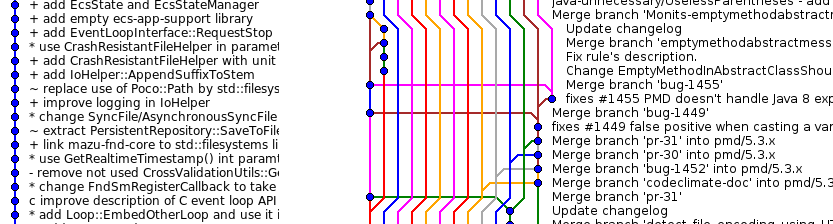

---

\huge

> *Improving Code Quality and Team Knowledge by correctly using Reviews.*

Overall Goal
------------

\Large

1. high quality code & good knowledge exchange
1. efficient and valuable code reviews
1. clean and simple git history
1. clear git workflow

Git Workflow
============

[OneFlow](http://endoflineblog.com/oneflow-a-git-branching-model-and-workflow)
---------

\large

* Reduces git history to a linear history by replacing `merge` with `rebase`.
* Extensively used by team wingd.

\vspace{1cm}

---

\huge

> *You may use other git workflows. But you should know which one!*

\vspace{2cm}
\normalsize

[comparing-workflows](https://www.atlassian.com/git/tutorials/comparing-workflows)

`rebase` instead of `merge` for feature branches
------------------------------------------------

\colBegin{0.5}

~~~ {.numberLines}
// prepare history
git checkout -b feature
git commit
git commit
git checkout master
git commit
git commit

// merge commit
git merge feature
~~~

\colNext{0.5}

~~~ {.numberLines}
// revert merge
git reset --hard HEAD~1

// rebase
git checkout feature
git rebase master

// update master
git checkout master
git merge feature
~~~

\colEnd

Feature branches
----------------

\large

* belong to the *creator*
* only the creator is allowed to *push*
* creator is allowed to *change history arbitrarily*
* *force* push needed: `git push --force-with-lease`

\vspace{0.4cm}
\normalsize

### `~/.gitconfig`

~~~
[alias]
  pushfwl = push --force-with-lease
~~~

dependent feature branches
--------------------------

\colBegin{0.5}

~~~ {.numberLines}
// consecutive feature branches
git checkout -b feature1
git commit
git checkout -b feature2
git commit

// feature1 progresses
git checkout feature1
git commit
git commit

// master progresses
git checkout master
git commit
git commit
~~~

\colNext{0.5}

~~~ {.numberLines}
// feature1 rebased to master
git checkout feature1
git rebase master

// normal rebase would create
// merge conflict here
git checkout feature2
git rebase feature1   // conflict

git reset --hard C3

// rebase onto allows to explicitly
// select all to pick commits
// (does not work in DEMO)
git rebase --onto feature1 HEAD~1
~~~

\colEnd

Pull-Requests
=============

Pull-Requests
-------------

\Large

* a PR is a *tool* for code review
* requires a *clean and simple* git history
* requires *common understanding* how reviews are done
* PRs should be *well separated* and not too big

Prepare PR
----------

\large

1. clean-up git history
1. rebase to current master
1. open PR and create useful PR description
   $\break \rightarrow$ include relevant links e.g. to JIRA issues

### PR description

This improves the ability of the reviewer to understand what is done and how.
In addition it allows a good understanding of the task solved in the commit and therefore allows
a higher level review on concepts and architecture/design.

History Clean-Up
----------------

\large

* do squash all commits that only *add a single new feature*
* separate small and consistent commits that *change existing code*
* each commit should *build* (and pass all tests)
* refine commit *descriptions*

Tools:

* `git commit --amend`
* `git rebase -i`
* `gitfix`
* `git gui` for line/block staging

\vspace{0.4cm}

Create clean history from the beginning
---------------------------------------

\large

1. Each time you notice a *missing refactoring*
1. create a new *branch* and commit unfinished changes
1. *first* make refactorings on "main feature branch"
1. *rebase* old branch and continue

\vspace{1cm}

### stash

`git stash` can be used instead of separate branch

Iteration Process
-----------------

\large

* Review
  * reviewer overlooks whole PR to gain knowledge about *big picture*
  * reviewer steps through each *commit* (chronologically)
    and creates *comments* (questions) and *tasks* (concrete improvements)
  * reviewer does *accepts or denies* PR
  * if PR is not finished we *iterate* between rework/review until accepted

\vspace{1cm}

* Rework
  * *Answer* open questions directly in comments (this is documentation!).
  * Fix mentioned bugs and resolve added *tasks*.
    Tasks can be directly *closed*.
    Other things only mentioned in comments should be *answered* with something like "done" or "fixed with ..."

Finalization
------------

\large

After all/enough reviewers have accepted the PR the review process is finished and the PR can be merged.

* the creator of the PR rebases the feature branch to the current master
* force push
* use "Merge" button in PR-Gui
* select to delete original feature branch after merge

The local git state can clean-up not existing remote branches with:

~~~
git remote prune origin
~~~

Conclusion
==========

Conclusion
----------

\large

* *use* PRs with teams bigger then 1 member (or even with only 1)
* choose a *useful* git workflow
* use the *PR tool* provided by your git hosting solution (e.g. BitBucket, gitlab)
* *learn* how to work together with these tools

\vspace{1cm}

\Large

> *Think about the person on the other side of the tool!*

Addendum
========

Git commit description
----------------------

Example structure:

~~~ {.numberLines}
category/component: Commit message summary

Commit message body explaining what was was changed and why.
May consist of multiple lines or even multiple paragraphs.

Issue: WINGDECSSW- 9999
~~~

How to write good git commits
-----------------------------

Beim Schreiben der Commit Message sollten folgende Regeln beachtet werden:

* Die erste Zeile enthält eine Zusammenfassung, ist nicht länger als 70 Zeichen und endet nicht mit einem Punkt.
* Die erste Zeile verwendet den Imperativ bzw. Präsens
  (Add support for X" anstatt "Added support for X" oder "Adds support for X").
  Die restliche Commit Message verwendet den Präsens um zu beschreiben, was der Patch ändert.
  Die Vergangenheitsform kann verwendet werden, um den Code vor dem Patch zu beschreiben.
* Wenn sinnvoll, kann in der ersten Zeile ein Prefix mit Doppelpunkt verwendet werden,
  um den Codebereich zu beschreiben, der geändert wird (z.B. "ssh: decrease ServerAliveInterval to 60 seconds").
* Nach der ersten Zeile folgt eine Leerzeile und eine ausführlichere Beschreibung.
  Wenn die Zusammenfassung bereits ausreicht, kann auf die Beschreibung verzichtet werden.
* Die maximale Zeilenlänge in der Commit Message ist 72 Zeichen.

Helpers - git aliases
---------------------

In `~/.gitconfig`

~~~ {.numberLines}
[alias]
  pushfwl = push --force-with-lease
  co = checkout
  ci = commit
  st = status
  br = branch
  ri = rebase -i
  ra = rebase --abort
  rc = rebase --continue
  rs = rebase --skip
  ma = merge --abort
  mc = merge --continue
  mq = merge --quit
  hist = log --pretty=format:"%h %ad | %s%d [%an]" --graph --date=short
~~~

Helpers - `gitfix`
------------------

Bash-function. Needs to be sourced.

~~~ {.numberLines}
function gitfix {
  if [ $# -ne 1 ]; then
    echo "Invalid number of arguments. Expecting a single commit hash!"
  else
    local FIXUP_COMMIT="$1"
    local FIXUP_COMMIT_MESSAGE=$(git log --format=%B -1 $FIXUP_COMMIT)
    echo "Fixing up commit \"$FIXUP_COMMIT_MESSAGE\" \
      ($FIXUP_COMMIT) with current staged changes"

    git commit --fixup "$FIXUP_COMMIT" && \
      GIT_SEQUENCE_EDITOR=: git rebase --interactive \
      --autostash --autosquash "$FIXUP_COMMIT"~1
  fi
}
~~~

Helpers - `gitfix` -  Usage
---------------------------

~~~ {.numberLines}
// stage your changes e.g. with git gui
git gui

// check which commit to fix e.g. with git log
git log --oneline

// now append the staged changes to the selected commit
gitfix <commit-hash>

// this results in rebasing and therefore changing the history until the selected commit
~~~

Links
-----

* Interactive git tutorial: [learngitbranching.js.org](https://learngitbranching.js.org/?NODEMO)
* Modern git workflow: [OneFlow](http://endoflineblog.com/oneflow-a-git-branching-model-and-workflow)
* Atlassian Article: [comparing-workflows](https://www.atlassian.com/git/tutorials/comparing-workflows)
* How to write good git commits: [chris.beams.io](https://chris.beams.io/posts/git-commit/)
