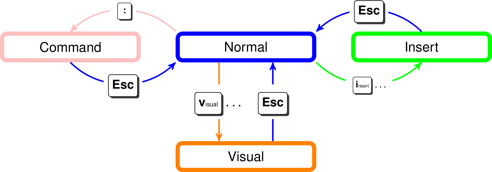
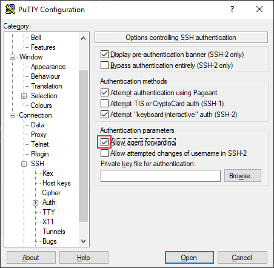

<#include meta/slides.md>

---
title: "Linux"
date: \today
---

Wieso Linux?
-------

* Open Source
* Verschiedene Distributionen für verschiedene Zwecke
  * Headless für Server und Embedded Devices
  * GUI gibt es von simpel bis Gnome/KDE mit Window Manager
  * Mit kommerziellem Support (RedHat) oder nur community support, dafür ohne Gebühren
  * Grosse Verbreitung, z.b. bei PaaS, Managed Hosting, Embedded Devices
* Die Distributionen sind ähnlich

Wieso Shell?
-------

* Viele Maschinen haben gar kein GUI
* Zugriff auf gewisse Einstellungen/Programme/Funktionalitäten gibt es nur per Shell
* Ermöglicht einfach die Automatisierung (Provisioning, Initialisierung, cron, Überwachung/Neustart, Deployment)
* Braucht weniger Ressourcen

Wer/Wo/Was bin ich?
-------

* Eingeloggter User: `whoami`
* Gruppen: `groups`
* Print working directory: `pwd`
* Informationen über das OS: `cat /etc/*-release`
* Home Directory: `cd ~` oder einfach `cd`
* Prozesse die laufen:
  * Für alle Prozesse `ps axjf`
  * Für einen bestimmten Prozess: `ps fu -C sshd`
  * Übersicht: `top` oder `htop`
* Prozess beenden:
  * `kill <pid> [-9]`
  * `pkill firefox`
  * `killall firefox`
* ip Adressen: `ip a`

File manipulation
-------

* Liste der Dateien in Directory: `ls`
* Directory anlegen: `mkdir mydir`
* File anlegen/Last modified auf now setzen: `touch myfile`
* Umbenennen (move): `mv myfile movedfile`
* Kopieren:
  * File: `cp movedfile copiedfile`
  * Directory: `cp -r mydir copieddir`
* Löschen:
  * File: `rm movedfile`
  * Directory: `rm -r mydir`
* Mit bash (nicht mit sh) können Platzhalter verwendet werden:
  * Liste alles auf, das mit D anfängt: `ls ~/D*`
  * Liste alles auf, das in einem Subfolder von Home ist: `ls ~/**/`
  
History
-------

* Jeder Befehl, den man ausführt, wird nach der Ausführung in ~/.bash_history gespeichert
* Deshalb *keine Passwörter* in einem Befehl eingeben.  
  Stattdessen beim Programm die Option für Password Prompt verwenden.
* Mit `history` kannst du die History ausgeben. Diese kann lang sein, deshalb eventuell: `history | less`
* Mit `UP`/`DOWN` kannst du den letzten/nächsten Eintrag auf die Kommandozeile holen
* Mit `Ctrl+R` kannst du die History durchsuchen
  * Nochmals `Ctrl+R` führt dich zum nächsten match
  * `Ctrl + Shift + R` führt dich zum vorherigen match
  * `Tab` bringt den Eintrag auf die Kommandozeile, ohne ihn auszuführen
  * `Enter` führt den Eintrag direkt aus

Bevor man etwas Gefährliches macht
-------

* Bei Unsicherheit: in Sandbox testen.
  * z.b. in einem anderen Directory
  * in einer VM
  * in einem Docker Container (Distro nach Wahl)  
`docker run --rm -it ubuntu bash`
* Vor rm/mv mit ls überprüfen, was man erwischen würde.  
Vor allem wenn man mit Platzhaltern arbeitet.
* Zeile zuerst mit einem `#` beginnen, dass es ein Kommentar ist.  
Dann die Zeile selber nochmals reviewen.

Programme
-------

* `ls`, `cp` usw sind Programme, die zur Verfügung stehen
* Sie stehen zur Verfügung, weil sie in einem der Pfade in $PATH sind
* Dabei ist es egal, ob sie vom OS zur Verfügung gestellt, durch ein Package installiert oder selber erstellt wurden.
* Wenn einfache Befehle wie `ls` nicht funktionieren, kann es sein, dass man in einem Kontext ohne definierte PATH
Variable ist. Dann müssen absolute Pfade verwendet werden. Oder man initialisiert die PATH Variable.

```
user@hostname:~$ echo $PATH
...:/bin:....
user@hostname:~$ which ls
/bin/ls
user@hostname:~$ whereis ls
ls: /usr/bin/ls /usr/share/man/man1/ls.1.gz
```

* Man kann die Programme auch mit dem absoluten/relativen Pfad aufrufen

Parameter
-------

Programme haben Parameter, das interface findet man mit `man` oder im Internet

Beispiel: `man rsync`

```
Local:  rsync [OPTION...] SRC... [DEST]

Access via remote shell:
 Pull: rsync [OPTION...] [USER@]HOST:SRC... [DEST]
 Push: rsync [OPTION...] SRC... [USER@]HOST:DEST

Access via rsync daemon:
 Pull: rsync [OPTION...] [USER@]HOST::SRC... [DEST]
       rsync [OPTION...] rsync://[USER@]HOST[:PORT]/SRC... [DEST]
 Push: rsync [OPTION...] SRC... [USER@]HOST::DEST
       rsync [OPTION...] SRC... rsync://[USER@]HOST[:PORT]/DEST
```

Demo rsync verwenden Anhand von manpage
-------

Pipe + Redirection
-------

* Programme in Linux können auf verschiedene Art und Weise verbunden werden
* Pipe: `|`


Beispiel:

```shell
env | sort
```

Der Output des vorherigen Programms wird schon vor dem Programmende in die Pipe eingefügt.
Dies ermöglicht eine parallelisierte Ausführung.

```shell
i=0; while true; do ((i=i+1)); echo "test$i"; sleep 0.5; done \
| egrep "2|4|6|8"
```

Pipe + Redirection
-------

* Output Redirection mit `>`  
  Output von Programm in File schreiben: `ls -l > lsoutput`
* Output an File anhängen mit  `>>`  
  `ls -l >> lsoutput`
* Input Redirection mit `<`  
  `grep "myfile" < lsoutput`  
  *Achtung* schlechtes Beispiel für grep, einfacher: `grep "myfile" lsoutput`

Aufgabe Bash Befehle in Linux
-------

Editors
==============

Nano
-------

* Steht oft zur verfügung
* Datei erstellen/editieren: `nano myfile`
* Speichern: `Ctrl + O`, dann `Enter`
* Beenden: `Ctrl + X`
* Text markieren: `Alt + M` + Maus, oder mit den Pfeiltasten und mit `Alt + M + A` den Start setzen.
* Kopieren: Normal mit copy `Ctrl + Shift + C` (bei Linux Terminals)
* Paste: Normal mit paste: `Ctrl + Shift + V`
* Copy Line: `Alt + 6`
* Cut Line: `Ctrl + K`
* Paste Line: `Ctrl + U`
* Suchen: `Ctrl + W`

Vi/Vim
-------



[modes.png](https://github.com/nilp0inter/Vim-for-Muggles/blob/8ba350ff6f993d6bbb5ae17a8b03dac16eb2c05d/modes.png) von
 [Roberto Abdelkader Martínez Pérez](https://github.com/nilp0inter), Lizenz:
 [CC BY 4.0](http://creativecommons.org/licenses/by/4.0/)

Vi/Vim 2
-------

* Steht oft zur verfügung
* Idee: Maus und Maustasten werden nicht gebraucht.  
Hände müssen nie von der Grundposition weg bewegt werden.
* Datei erstellen/editieren: vim myfile
* Normal Mode
  * Cursor bewegen: Pfeiltasten oder Left: `l`, Up: `k`, Down: `j`, Right: `h`
  * Paste: `p`
  * To insert Mode: `i` (Text bearbeiten)
  * To visual Mode: `v` (Text selektieren)
  * To command Mode: `:`
  * Einfach text selektieren: mit Maus und `Ctrl + Shift + C`
* Insert Mode
  * Cursor bewegen: Pfeiltasten
  * To normal mode: `ESC`

Vi/Vim 3
-------

* Visual Mode
  * Cursor bewegen: Pfeiltasten oder Left: `l`, Up: `k`, Down: `j`, Right: `h`
  * Copy: `y` (Beendet visual mode)
  * to normal Mode: `ESC`
* Command Mode
  * Hilfe: `help [String]`, dann `Ctrl + D` um zu match zu springen  
Achtung: öffnet Hilfe in split window
  * Zwischen split windows switchen: `Ctrl + W`, dann Pfeiltasten Up oder Down
  * Save: `w`
  * Quit: `q`
  * Quit without saving: `q!`

tmux
-------

* Programm um mehrere Shells als Tabs oder im Split Mode zu öffnen
  * Die einzelnen Teile im Split Mode heissen *Pane* bei tmux
  * Auch *T*erminal *Mu*ltiple*x*er
* Kann auch Session Management
  * Wenn die SSH Verbindung unterbrochen wird, kann man die alte Session wieder öffnen
  * Man kann auch mehrere Sessions für mehrere parallele Tasks offen halten
* Setzt auf Modes und Shortcuts für die Interaktion
* Starten: `tmux`

tmux 2
-------  

* Prefix Key: `Ctrl + b`, braucht man vor jedem tmux Befehl/Shortcut
* Split Pane:
  * `%` horizontal
  * `"` vertikal
* Switch Pane:
  * `q` Nummeriert die Panes, mit `[0-9]` die Pane auswählen
* Neues Window (Tab): `c`
  * Navigieren zwischen Windows: `n` für next, `p` für previous, `0-9` um direkt zu Fenster zu springen.
* Exit Pane/Window: `exit` oder `Ctrl + d`
* Close Session: Close all Panes/Windows in Session
* Detach Session: `d`
* List Sessions: `tmux ls`
* Attach to Session: `tmux attach -t SESSION_NUMBER`

users, roles and permissions
==============

Owner/Group
-------

Unter Linux kann man die Berechtigungen für eine Datei/Ordner auf drei Stufen definieren:

* user: Besitzer:in der Datei
* group: Gruppe der Datei
* other: Berechtigung für Benutzer:innen, die weder Besitzer:in der Datei sind, noch in der Gruppe der Datei sind.

Ermitteln von user/group einer Datei/Directory:

```
$ ls -l myfile
-rw-rw-r-- 1 vagrant vagrant 5 Jun 10 09:04 myfile
```

Ändern von user \[und group\]:  
`chown [OWNER][:[GROUP]] FILE`

Permissions
-------

Es gibt drei Flags für Berechtigungen, die man für jede Stufe setzen kann:

* read
* write
* execute (Bei Directories: Berechtigt den Zugang zu Files im directory)

```
$ ls -l
-r-xr-xr-x 1 vagrant vagrant     5 Jun 10 09:04 myfile
drwxr-xr-x 2 vagrant vagrant  4096 Jun  9 14:03 Music
```

Ändern der Flags für Berechtigungen

```
#füge die execute + read Berechtigung hinzu
#entferne die write Berechtigung
chmod +xr-w myfile
```

Permissions
-------

```shell
#füge die execute + read Berechtigung für user und group hinzu
chmod ug+xr myfile
```

*Achtung*  
Da das "-r" schon verwendet wird, um die read Berechtigung zu entfernen,
steht es nicht für "recursive".  
Für "recursive" muss man bei chmod und chown -R verwenden.

Wie soll ich Berechtigungen vergeben
-------

Reale User

* Haben Zugriff auf /home/\$USER
* Files dort gehören ihm, man kann die Berechtigungen nach Belieben vergeben
* Einer der Spezialfälle: `.ssh/authorized_keys`  
und SSH Keys müssen \$USER:\$USER `-rw-------` Berechtigung haben
* Programme, die der User ausführt, legen oft dotfiles hier ab. (z.b. ~/.cache)

Permissions
-------

Applikationsuser

* Haben read+write Zugriff auf ihre Konfiguration in /etc

```shell
$ ls -lh /etc/postgresql/12/main
drwxr-xr-x 2 postgres postgres 4.0K Jun 10 13:27 conf.d
-rw-r--r-- 1 postgres postgres  315 Jun 10 13:27 environment
...
```

* Haben read + execute Zugriff auf ihre executables

```shell
$ ls -lah /usr/lib/postgresql/12/bin/
-rwxr-xr-x 1 root root  67K May 18 12:13 createdb
-rwxr-xr-x 1 root root 7.8M May 18 12:13 postgres
...
```

Permissions
-------

* Haben write Zugriff auf ihre persistenz (aber sonst niemand)

```shell
$ls -lh /var/lib/postgresql/12/main/
drwx------ 5 postgres postgres 4.0K Jun 10 13:27 base
drwx------ 2 postgres postgres 4.0K Jun 10 13:27 global
drwx------ 2 postgres postgres 4.0K Jun 10 13:26 pg_commit_ts
drwx------ 2 postgres postgres 4.0K Jun 10 13:26 pg_dynshmem
...
```

* Haben write Zugriff auf logfiles die sie schreiben

```shell
$ ls -lh /var/log/postgresql/
-rw-r----- 1 postgres adm 571 Jun 10 13:27 postgresql-12-main.log
```

Permissions
-------

* Haben read/write Zugriff auf ihre runtime Files (.pid und anderes)

```shell
ls -lh /var/run/postgresql/
drwxr-s--- 2 postgres postgres 100 Jun 10 13:45 12-main.pg_stat_tmp
-rw-r--r-- 1 postgres postgres   6 Jun 10 13:27 12-main.pid
```

Scripts
==============

Scripts
-------

* Um einen Prozess zu automatisieren, kann man mehrere Programmaufrufe in einem Skript zusammenfassen.
* Das Skript kann man für einen beliebigen installierten Interpreter schreiben (sh, bash, python).
* Während der Entwicklung kann das Skript mit dem Interpreter aufgerufen werden.  
z. B. `bash myscript`, `python myscript`
* Für den produktiven Einsatz sollte der Interpreter mit der shebang line (1. Zeile) angegeben werden  
`#!/usr/bin/sh`  
`#!/usr/bin/python`  
Dann muss man den Interpreter nicht erraten, sondern kann einfach `/usr/local/bin/myscript` aufrufen.

Scripts
-------

* Da sh bei allen Linux Systemen verfügbar ist, fahren wir mit sh fort.
* Debugging: `set -x`  
Während der Entwicklung kann man so jede ausgeführte Zeile ausgeben lassen.  
Dies für den produktiven Gebrauch wieder entfernen!
* Bei Fehler abbrechen: `set -e`  
Normalerweise fährt das Script nach einem Fehler fort.  
Dies kann zu Problemen führen, deshalb das Skript bei einem Fehler abbrechen lassen.
  
Scripts Beispiel
-------

```shell
#!/bin/sh

set -e

# Das Skript könnte von überall aufgerufen werden.
# In $0 ist der Pfad dieses Skripts,
# mit realpath in absoluten Pfad umwandeln.
SCRIPT_DIR=$(dirname $(realpath $0))
TOPLEVEL_DIR=$(realpath $SCRIPT_DIR/../..)
HOST=auto@bls-m

cd $TOPLEVEL_DIR
ant -f startup zip.prod-depl.generic
sh $SCRIPT_DIR/deploy-testdata bls $HOST
sh $SCRIPT_DIR/deploy-rsync startup/target-ant/productive-depl-generic.zip $HOST
```

Aufgabe Hello World Service 1
-------

Weiteres
==============

Root
-------

* Der root Benutzer (mit userid 0) darf alles.
* Bei v.a älteren Systemen hatte der root ein Passwort, und man konnte sich mit  
`su root` oder mit `ssh root@HOST` root werden.  
Nachteil: Wenn jemandem dieses Recht entzogen werden soll, müssen sich alle anderen ein neues Passwort merken.  
Weiter ist die Nachvollziehbarkeit schwieriger.
* Bei neueren Systemen wird deshalb der Befehl `sudo` verwendet.
Benutzer:innen in einer bestimmten Gruppe dürfen mit `sudo` root Rechte erhalten. Meistens heisst die Gruppe sudo.  
Sie müssen dafür in der Regel *ihr eigenes* Passwort nochmals eingeben.

*Achtung:* mit der root shell aufpassen, man darf wirklich alles!

Package Management
-------

* Von Hand Programme zu installieren ist mühsam
* Deswegen kommen die meisten Distributionen mit einem Package Management System
* Auch Abhängigkeiten in der richtigen Version installiert der Package Manager.  
Wenn die Abhängigkeiten nicht aufgelöst werden können, schlägt die Installation fehl.

Distro | Familie | Package Manager
--- | --- | --- | ---
Alpine | unabhängig | apk
Ubuntu | Debian | apt
Fedora | RedHat | yum

Package Management
-------

Wie installiere ich ein Paket mit apt?

1. Herausfinden, welches Paket man braucht.  
Oft heisst es gleich wie der Dienst/das CLI-Tool, das man braucht.
Manchmal heisst das Packet anders, oder ist Teil eines grösseren Pakets.
[https://packages.ubuntu.com/](https://packages.ubuntu.com/)  
*Dabei auf die Version des OS achten*
1. `sudo apt update`  
So wird lokal der Index mit den Paketen und Abhängigkeiten geupdated.
1. `sudo apt install PACKAGE`

Entfernen:  
`sudo apt purge PACKAGE`

Nicht mehr benötigte Abhängigkeiten entfernen:  
`sudo apt autoremove`

Package Management
-------

Alle Packages updaten:  
`sudo apt upgrade`

Einzelnes Package updaten:  
`sudo apt install --only-upgrade PACKAGE`

Logs
-------

* Logs von Linux Daemons liegen in /var/log
* Mit less erste Analyse machen
  * `/SEARCHSTRING` für Suche verwenden, `Enter` um Suche zu starten
  * `N` für den nächsten Treffer
  * `Shift + N` für den vorherigen Treffer
  * `Shift + G` um ans Ende des Files zu springen
  * `UP`/`DOWN` für eine Zeile nach unten/oben
  * `PAGE DOWN`/`PAGE UP` für eine Seite nach unten/oben
  * `Shift + F` für follow, `Ctrl + C` um follow zu beenden
* Mit `grep "SEARCHSTRING" mylogfile.log [-A LINES_AFTER] [-B LINES_BEFORE]`  
  weitere Analysen machen.  
  Weitere hilfreiche Programme:
  `tail [-n NUMBER_OF_LINES]`/`head [-n NUMBER_OF_LINES]`, `wc -l`
* Falls nichts weiterhilft, kann man noch im syslog nachschauen:  
`less /var/log/syslog`

journalctl
-------

* Programm um Logs von journald (Logging Service von systemd) zu filtern
* Nur für logs, die auch im journald landen
  * keine selbst angelegten Logs (von z.b. log4j)
  * keine Logs von docker (falls nicht so konfiguriert)
* Boot messages: `journalctl -b`
* Filtern nach Zeit: `journalctl --since "1 hour ago"`  
  `journalctl --since "2015-06-26 23:15:00" --until "2015-06-26 23:20:00"`
* Nach Unit: `sudo journalctl -u cron.service`
* Follow: `journalctl -f`
* Neuste Meldungen zuerst: `journalctl -r`, springe ans Ende: `journalctl -e`
* Output Formate können definiert werden (z.b. jsonwill, json-pretty, cat)

Quelle: [www.loggly.com/ultimate-guide/using-journalctl](https://web.archive.org/web/20210630131216/https://www.loggly.com/ultimate-guide/using-journalctl/?CMP=KNC-TAD-GGL-SW_DACH_X_PP_CPC_LD_EN_PROD_SW-LGL-12302661008~119270368964_g_c_-b~497490656877~~1003297~~)

SSH
-------

* Steht für *S*ecure *Sh*ell
* Stellt über das Netz eine Shell auf einem Computer zur Verfügung.  
`ssh [USER@]HOST`
* Für Windows gibt es verschiedene Implementationen, hier zwei Beispiele:
  * PuTTY (Mit GUI)
  * git bash hat openssh-client eingebaut.  
  git bash wird installiert, wenn man git auf Windows installiert.
* Authentifizierung über Username/Passwort oder Username/Public + Private Key Pair
* Die Verbindung wird asymmetrisch Verschlüsselt

SSH Client
-------

* Die Konfiguration des Clients kann an folgenden Orten sein
  * Als Teil von PuTTY
  * In eurem Home Folder (Windows: `C:\Users\%USERNAME%\.ssh` oder (in der SCS) `H:\.ssh`, Linux: `~/.ssh`)
* Die Konfiguration im Home Folder hat folgende Files:
  * known_hosts: Falls du dich das erste Mal mit einem Host verbindest,  
wirst du gefragt, ob du dem Public Key des Servers vertraust.  
In diesem File sind die Hosts und die Hashes der Public Keys (1 pro Host), denen du vertraut hast.
  * id_rsa, id_rsa.pub oder weitere Keys:  
Private und Public Keys, die für ssh Verbindungen verwendet werden können.
  * config  
  Die SSH Config, falls welche Konfiguriert ist.

SSH Server
-------

* /etc/ssh/sshd_config  
Hier ist der Server konfiguriert.  
z.b. ob Authentifizierung mit Passwort erlaubt ist, mit welchen Usern/Gruppen man sich per
ssh einloggen kann. Oft gibt es eine Gruppe ssh oder sshlogin, deren User sich einloggen dürfen.
* /home/$USER/.ssh/authorized_keys  
Hier sind die public keys, mit denen man sich als dieser User einloggen kann.

Eigenen Key hinzufügen: `ssh-copy-id [USER@]HOST`  
Oder manuell:  
Auf lokaler Maschine: `cat ~/.ssh/id_rsa.pub`  
Und dann remote den key ins authorized_keys File einfügen.

Private Key erstellen: `ssh-keygen -t rsa -b 4096`

Authentication Agents
-------

* *Nie persönliche private Keys auf remote Maschinen kopieren*
* Hier einige Implementationen:
  * Windows: pageant
  * Windows: ssh-agent (Mit git bash mitgeliefert, oder mit openssh)
  * Linux: ssh-agent

\centering
{width=60%}

Putty Agent forwarding
-------

\centering
{height=80%}

Command line Agent forwarding
-------

* shell: `ssh -A`
* ssh config:

```
Host jumpstart
  User vagrant
  Hostname localhost
  Port 2222
  ForwardAgent yes
```

Linux Directory Struktur
-------

\centering
{height=90%}  
Grafik benutzt Material von [Wikipedia](https://en.wikipedia.org/wiki/Filesystem_Hierarchy_Standard), Lizenz:
 [CC BY-SA](https://creativecommons.org/licenses/by-sa/3.0/)


Daemons
-------

* Prozesse hängen normalerweise an dem Prozess, der sie gestartet hat
* Mit einem `&` am Ende des Befehls kann man den Prozess in den Hintergrund verschieben
  * Wenn man die Shell schliesst, wird der Prozess trotzdem abgebrochen

```shell
# $$ gibt die PID es momentan laufenden Prozesses aus
$ ps fu $$
USER         PID  TIME COMMAND
vagrant    44484  0:00 -bash
vagrant    44634  0:00    \_ ps fu
```

Daemons 2
-------

```shell
# in der bash eine neue bash starten -> startet neuen Prozess
$ bash
$ ps fu $$
USER         PID TIME COMMAND
vagrant    44484 0:00 -bash
vagrant    44607 0:00  \_ bash
vagrant    44634 0:00      \_ ps fu
```

Daemons 3
-------

```shell
# in dieser bash einen Hintergrund Prozess starten
$ watch echo 1 &
$ ps fu $$
USER         PID    TIME COMMAND
vagrant    44484    0:00 -bash
vagrant    44607    0:00  \_ bash
vagrant    44677    0:00      \_ watch echo 1
vagrant    44706    0:00      \_ ps fu

# Den parent Prozess des Hintergrund Prozesses killen
$ kill -9 44607
# Hintergrund Prozess ist weg
$ ps fu 44677
USER         PID  TIME COMMAND
```

Systemd
-------

* Package um Daemons (Hintergrund Prozesse) zu verwalten
* System und Sitzungsmanager für Linux (Verwendet in Ubuntu, Fedora, Debian...)
* Bootstrapped das Betriebssystem
* Definiert Abhängigkeiten zwischen den Units
* .service File in /etc/systemd, um Dienste zu konfigurieren
* Minimale Möglichkeiten für HealthCheck + Restart, das reicht aber meistens
* Befehle:
  * Status: `service hardware-init status`
  * Starten/Stoppen/Restart: `sudo service hardware-init (start|stop|restart)`
  * Nach Änderung von .service file neu laden: `sudo systemctl reload hardware-init.service`
  * Enable: `sudo systemctl enable hardware-init.service`
  * Disable: `sudo systemctl disable hardware-init.service`
  
* Abhängigkeitsbaum Anzeigen: `systemctl list-dependencies`
* Analyse: `systemd-analyze`

Systemd .service file
-------

```
[Unit]
# This service needs systemd-modules-load.service started
# stops when systemd-modules-load stops
Requires=systemd-modules-load.service
# This service should be started after systemd-modules-load.service
# But does not wait on its completion
After=systemd-modules-load.service

[Service]
Type=oneshot
ExecStart=/usr/local/bin/hardware-init start
ExecStop=/usr/local/bin/hardware-init stop
RemainAfterExit=yes

[Install]
WantedBy=multi-user.target
```

Aufgabe Hello World Service 2
------

Zusammenfassung
------

* Wer/Wo/Was bin ich?, Basic Commands
* Bevor man etwas Gefährliches macht
* Pipe + Redirection
* Editors
* Linux Permissions
* Scripts
* Root, Package Management, journalctl
* SSH
* Daemons
