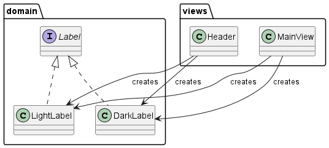
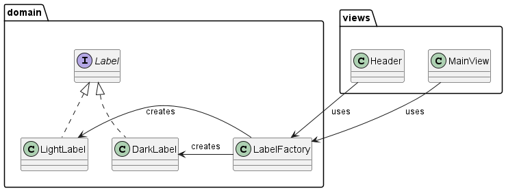
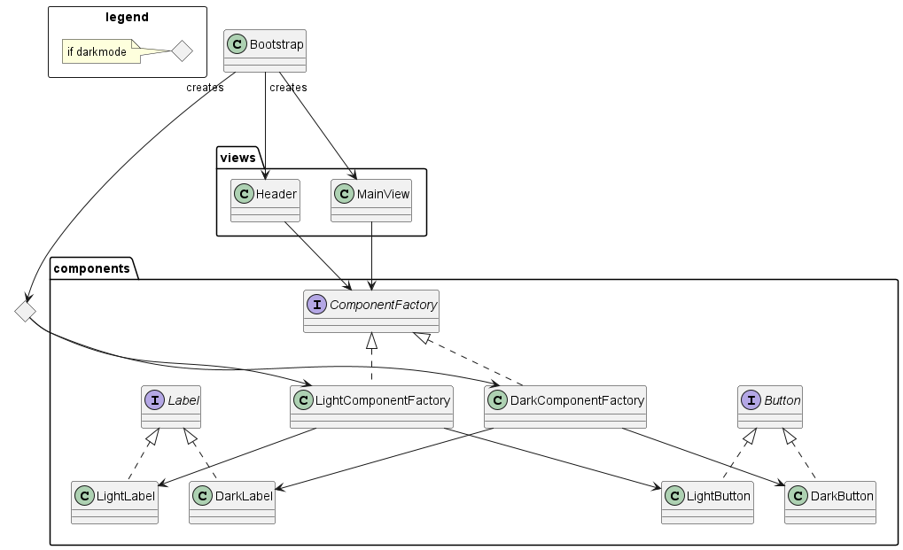

<#include meta/slides.md>

---
title: "SW Konzepte"
date: \today
---

Was ist hier falsch?
-------

Code Beispiel: [abstractions.py](code/abstractions.py)

abstractions.py Zusammenfassung
-------

* Fast keine Strukturierung durch Methoden/Funktionen
* Code duplication

Abstraktion: Nachteile
-------

* Erhöht Komplexität
* Änderung der Abstraktion haben Auswirkungen auf alle User
* Die Abstraktion am falschen Ort (Vertikal)
* Die Abstraktion versteckt wichtige Features

Abstraktion am falschen Ort
------

```java
public void initialize() {
    carouselDisposable.dispose();
    carouselDisposable = contactlessPMod.getCarouselProvider()
    .addCarouselObserver(
        imagePath -> JfxThreadingUtils.invokeOnFx(() -> setContactlessLogo(imagePath))
    );
}

private void setContactlessLogo(String imagePath) {
    if (imagePath == null || getAcceptance() != ACCEPTED) {
        final String imageFileName = getImageFileName()
        final String imageUrl = IMAGES_PATH + imageFileName;
        contactlessLogo.setImage(new Image(imageUrl));
    } else {
        if (contactlessPMod.isCarouselEnabled()) {
            contactlessLogo.setImage(new Image(imagePath));
        } else {
            contactlessLogo.setImage(new Image(IMAGES_PATH + "static_carousel.png"));
        }
    }
}
```

Agenda
-------

* Generelle Prinzipien (DRY, KISS...)
* Clean Code
* Design Patterns

DRY
-------

* **D**on't **R**epeat **Y**ourself
* Für **Verhalten** aber auch für **Information**
* Idee: Wenn man Verhalten oder Information ändern muss,
dann kann man das an einer Stelle tun.\
Sonst müssen alle Kopien angepasst werden.
* Der Name der extrahierten Methode (z.b. für Verhalten)
oder Konstante (z.b. für Information) sollte den Inhalt beschreiben.

DRY Beispiel für Konstanten 1
------

```java
assertEquals(new DateTime(2013, 6, 5, 12, 54).toDate(), view.getServiceStartDate());
assertEquals(new Long(4), view.getServiceSerialId());
assertEquals(new Long(2), view.getServicePeriodSerialId());
assertEquals("RGS_EMPTYING_TO_RETURNTRAY", view.getServiceType());
```

DRY Beispiel für Konstanten 2
------

```java
assertEquals(SERVICE_START_DATE, view.getServiceStartDate());
assertEquals(SERVICE_SERIAL_ID, view.getServiceSerialId());
assertEquals(SERVICE_PERIOD_SERIAL_ID, view.getServicePeriodSerialId());
assertEquals(ServiceType.RGS_EMPTYING_TO_RETURNTRAY, view.getServiceType());
```

KISS
-------

* **K**eep **i**t **S**hort and **S**imple\
  (Keep it simple stupid)

```python
# num % (modulo) 2 with a bitwise operator:
num & 1
# it is simpler and more readable
# to use the % operator.
num % 2
```

Erklärung Modulo 2 mit Bit operator
-------

```md
5   = 00000101 &
1   = 00000001
--------------
      00000001 -> ungerade
```

YAGNI
-------

* **Y**ou **a**ren't **g**onna **n**eed **i**t

NIH
-------

* **N**ot **i**nvented **h**ere
* Dinge nicht selber implementieren, die schon in der Sprache oder einer Library enthalten sind.

NIH Beispiel 1
-------

<https://github.com/ecamp/ecamp3/blob/9709aa8a7b83b0c65ce1a0ce0a94710a77a6ebdd/api/src/Service/CampCouponService.php>

Clean Code
-------

* **S**ingle Responsibility
* **O**pen Closed Principle
* **L**iskov's Substitution Principle
* **I**nterface Segregation
* **D**ependency Inversion

Single Responsibility
-------

* Eine Funktion, Klasse, Modul sollte nur eine "Responsibility" haben.
* Grenze ist nicht ganz klar.
* Indikator: Wenn bei der Bezeichnung ein "and" vorkommt, dann sollte man aufteilen.
* Andere Sichtweise: Eine Funktion, Klasse, Modul sollte nur einen Grund haben, sich zu ändern.

Beispiel Single Responsibility verletzt
------

```java
public enum DirectionAndRazziaValue {
    DIRECTION_1,
    DIRECTION_2,
    RAZZIA
}

private static void updateCountersAndLogEjectedCoins(...)

public SessionFactoryBuilder withUserAndPassword(String username, String password) {
    this.username = username;
    this.password = password;
    return this;
}

```

Beispiel Single Responsibility verletzt mit Kommentar
------

```java
// Werte in unabhängige Felder packen
// Hier sind zwei eher unabhängige Zustände (Richtung 1/2, Razzia)
// in einem Feld abgebildet.
public enum DirectionAndRazziaValue {
    DIRECTION_1,
    DIRECTION_2,
    RAZZIA
}

// Trennen der zwei Aufgaben
private static void updateCountersAndLogEjectedCoins(...)

// in zwei Methoden aufteilen: es ist ja schon ein Builder
public SessionFactoryBuilder withUserAndPassword(String username, String password) {
    this.username = username;
    this.password = password;
    return this;
}

```

Open Closed
-------

* "Open for extension, closed for modification"
* Für neue Funktionalität
  * Bestehenden Code nicht anpassen
  * Möglichst nur neuen Code hinzufügen

Open Closed Beispiel
-------

Regeln für Dame:

* Eigenen Spielstein bewegen.
* Ziel-Feld muss leer sein.
* Bauer darf sich ein Feld weit bewegen, der König zwei Felder.
* Bauer darf sich nur vorwärts bewegen.
* Bewegung muss diagonal sein.
* Beim Springen muss gegnerische Figur übersprungen werden.
* Falls man springen kann, muss man springen.

<https://github.com/soco21/soco21-group8/blob/f4c0f734f759465c32a6a444ce8fa9656dacd6ec/assignment-1/exercise2/Class%20Diagramm%20Checkers.svg>

Open Closed Beispiel 2
-------

Wenn alle Regeln in separaten Klassen sind, macht das den Inhalt klarer.
Auch ist es jetzt einfacher, neue Regeln hinzuzufügen.
<https://github.com/soco21/soco21-group8/tree/fb763220b26d3ed0260580d944b92fe9172f6c7b/assignment-1/exercise3/src/main/java/ch/uzh/group8/assignment1/exercise3/movevalidator>

```java
class StartPieceValid {}
class TargetFieldEmpty {}
class MoveLength {}
class MoveIsForwardIfNotKing {}
class MoveIsDiagonal {}
class OpponentPieceBetweenJump {}
class NoOtherJumpMovePossible {}
```

Open Closed Beispiel 3
-------

Und es ermöglicht Komposition:

```java
  moveValidators = List.of(
            startPieceValid,
            targetFieldEmpty,
            moveLength,
            moveIsForwardIfNotKing,
            moveIsDiagonal,
            opponentPieceBetweenJump,
            noOtherMoveToJumpPossible
  );
  winCondition = new WinCondition(List.of(
            startPieceValid,
            targetFieldEmpty,
            moveLength,
            moveIsForwardIfNotKing,
            moveIsDiagonal,
            opponentPieceBetweenJump
  ));
```

Liskov's substitution principle
-------

* Implementationen eines Interfaces müssen ausgetauscht werden können.
* Sie nehmen mindestens die gleichen Inputwerte an (dürfen auch mehr).
* Sie geben maximal die gleichen Rückgabewerte zurück.
* Werfen maximal die gleichen Exceptions (oder Subtypen der Exceptions).

Beispiel einer Verletzung des Liskov's substitution principle
-------

```python
class Vehicle:
    pass

class Car(Vehicle):
    pass

class Bicycle(Vehicle):
    pass

class Garage:
    def park(self, vehicle: Vehicle):
        pass

class BicycleGarage(Garage):
    def park(self, vehicle: Vehicle):
        if (not isinstance(vehicle, Bicycle)):
            raise ValueError("BicycleGarage can only park bicycles")

```

Interface Segregation
-------

* Um die Kopplung zu reduzieren, kann man auch Interfaces aufteilen.
* Eine Klasse kann mehrere Interfaces implementieren
* Man will in einer Klasse nicht benötigte Methoden nicht implementieren
* Man möchte vermeiden, dass jemand unerwartet eine Methode verwendet,
die eigentlich nicht zur Verfügung gestellt werden sollte.

Interface Segregation Example
------

{height=95%}

Dependency Inversion
------

* Um zwei Klassen zu entkoppeln, kann ein Interface verwendet werden.
* Das verhindert, dass eine High-Level-Komponente von einer Low-Level-Komponente abhängt.

Dependency Inversion Beispiel 1
-----


Dependency Inversion Beispiel 2
-----

{height=95%}

Design Patterns
-------

<https://github.com/iluwatar/java-design-patterns>

Factory
-------

* Alias: Factory Method, Simple Factory
* Use Case:
  * Logik für die Erstellung eines Objekts kapseln und vereinheitlichen.
  * Wissen um konkrete Implementationen eines Interfaces zentralisieren.

von [Java Design Patterns/Factory](https://github.com/iluwatar/java-design-patterns/tree/07663ce2bdd46ca4697307068b9eb0d4c8888ead/factory)

Factory Beispiel: vorher
------

{width=78%}

Factory Beispiel: nachher
------



AbstractFactory
-------

* Use Case:
  * Es gibt 2 oder mehr Gruppen von Komponenten. Es sollen immer nur Komponenten aus einer der Gruppen erstellt werden.
    * Beispiel Light/Dark Theme: es soll entweder Light oder Dark Theme sein, aber nie gemischt.
  * Die gleichen If-Statements tauchen wiederholt an unterschiedlichen Stellen im Code auf. Man möchte diese Code-Duplizierung
  verhindern, indem man die If-Statements an einem zentralen Ort platziert.

von [Java Design Patterns/AbstractFactory](https://github.com/iluwatar/java-design-patterns/tree/07663ce2bdd46ca4697307068b9eb0d4c8888ead/abstract-factory/README.md)

AbstractFactory Beispiel: vorher
------
\colBegin{0.8}
{width=100%}
\colNext{0.2}
\colEnd

AbstractFactory Beispiel: nachher
------

\colBegin{0.8}
{width=100%}
\colNext{0.2}
\small

* Die Anzahl "if darkmode" statements ist reduziert.
* Es ist jetzt viel einfacher, ein "HighContrast"-Theme einzubauen.

\colEnd

AbstractFactory Beispiel 2
------


Strategy
-------

<https://github.com/iluwatar/java-design-patterns/blob/master/strategy/README.md>

Strategy Example
------

```python
class RouteNumberResolveStrategy:
    """
    Map the route number for lookup in assortment (menu structures, favorites, ...).
    """
    def resolve(self, route_number):
        pass


class IdentityRouteNumberStrategy(RouteNumberResolveStrategy):
    def resolve(self, route_number):
        return route_number

class OrganisationPrefixRouteNumberStrategy(RouteNumberResolveStrategy):
    def __init__(self, organisation_supplier):
        self.organisation_supplier = organisation_supplier

    def resolve(self, route_number):
```

Observer
-------

<https://github.com/iluwatar/java-design-patterns/blob/master/observer/README.md>

Observer Beispiel
-------

```java
public class CarouselProvider {

 private final Set<CarouselObserver> carouselObservers = Collections.synchronizedSet(new HashSet<>());
 private List<String> files = new ArrayList<>();
 private int counter = 0;

 public void addCarouselObserver(CarouselObserver observer) {
  carouselObservers.add(observer);
  observer.fileChanged(getCurrentImage());
 }

 public void removeCarouselObserver(CarouselObserver observer) {
    carouselObservers.remove(observer);
 }
}
```

Command
-------

<https://github.com/iluwatar/java-design-patterns/blob/master/command/README.md>

Zusammenfassung Abstraktion
------

* Mit Abstraktionen
  * \+
    * Strukturieren wir den Code
    * Geben Konzepten (Abläufen, Konstanten) einen Namen
    * Verstecken Details vor höheren Abstraktionsebenen
    * Machen den Code DRY
  * \-
    * Erhöhen wir die Komplexität
    * Verstecken Funktionalität
    * Koppeln die User der Abstraktion

Zusammenfassung
------

* High Level Abstraktionskonzepte
  * DRY
  * KISS
  * YAGNI
  * NIH
* SOLID Principles
  * Single Responsibility Principle
  * Open Closed Principle
  * Liskov's Substitution Principle
  * Interface Segregation Principle
  * Depdendency Inversion Principle
* Design Patterns
  * Factory (method)
  * AbstractFactory
  * Strategy
  * Observer
  * Command
