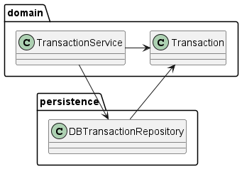
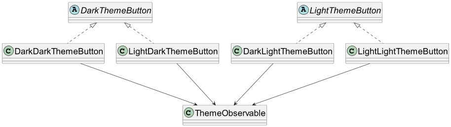

<#include meta/slides.md>

---
title: "SW Konzepte"
date: \today
---

Was ist hier falsch?
-------

Code Beispiel: [abstractions.py](code/abstractions.py)

abstractions.py Zusammenfassung
-------

* Fast keine Strukturierung durch Methoden/Funktionen
* Code duplication

Abstraktion: Nachteile
-------

* Erhöht Komplexität
* Änderung der Abstraktion haben Auswirkungen auf alle User
* Die Abstraktion am falschen Ort (Vertikal)
* Die Abstraktion versteckt wichtige Features

Abstraktion am falschen Ort
------

```java
public void initialize() {
    carouselDisposable.dispose();
    carouselDisposable = contactlessPMod.getCarouselProvider()
    .addCarouselObserver(
        imagePath -> JfxThreadingUtils.invokeOnFx(() -> setContactlessLogo(imagePath))
    );
}

private void setContactlessLogo(String imagePath) {
    if (imagePath == null || getAcceptance() != ACCEPTED) {
        final String imageFileName = getImageFileName()
        final String imageUrl = IMAGES_PATH + imageFileName;
        contactlessLogo.setImage(new Image(imageUrl));
    } else {
        if (contactlessPMod.isCarouselEnabled()) {
            contactlessLogo.setImage(new Image(imagePath));
        } else {
            contactlessLogo.setImage(new Image(IMAGES_PATH + "static_carousel.png"));
        }
    }
}
```

Agenda
-------

* Generelle Prinzipien (DRY, KISS...)
* Clean Code
* Design Patterns

DRY
-------

* **D**on't **R**epeat **Y**ourself
* Für **Verhalten** aber auch für **Information**
* Idee: Wenn man Verhalten oder Information ändern muss,
dann kann man das an einer Stelle tun.\
Sonst müssen alle Kopien angepasst werden.
* Der Name der extrahierten Methode (z.b. für Verhalten)
oder Konstante (z.b. für Information) sollte den Inhalt beschreiben.

DRY Beispiel für Konstanten 1
------

```java
assertEquals(new DateTime(2013, 6, 5, 12, 54).toDate(), view.getServiceStartDate());
assertEquals(new Long(4), view.getServiceSerialId());
assertEquals(new Long(2), view.getServicePeriodSerialId());
assertEquals("RGS_EMPTYING_TO_RETURNTRAY", view.getServiceType());
```

DRY Beispiel für Konstanten 2
------

```java
assertEquals(SERVICE_START_DATE, view.getServiceStartDate());
assertEquals(SERVICE_SERIAL_ID, view.getServiceSerialId());
assertEquals(SERVICE_PERIOD_SERIAL_ID, view.getServicePeriodSerialId());
assertEquals(ServiceType.RGS_EMPTYING_TO_RETURNTRAY, view.getServiceType());
```

KISS
-------

* **K**eep **i**t **S**hort and **S**imple\
  (Keep it simple stupid)

```python
# num % (modulo) 2 with a bitwise operator:
num & 1
# it is simpler and more readable
# to use the % operator.
num % 2
```

Erklärung Modulo 2 mit Bit operator
-------

```md
5   = 00000101 &
1   = 00000001
--------------
      00000001 -> ungerade
```

YAGNI
-------

* **Y**ou **a**ren't **g**onna **n**eed **i**t
* Beispiele:
  * Performanceoptimierung, bevor Performance zu einem Problem wird.
  * Design für Anforderungen, die möglicherweise in der Zukunft auftreten könnten.

 "We should forget about small efficiencies, say about 97% of the time: premature
 optimization is the root of all evil.
 Yet we should not pass up our opportunities in that critical 3%."

 [Knuth, Donald (December 1974). "Structured Programming with go to Statements"](https://pic.plover.com/knuth-GOTO.pdf)

NIH
-------

* **N**ot **i**nvented **h**ere
* Dinge nicht selber implementieren, die schon in der Sprache oder einer Library enthalten sind.

NIH Beispiel 1
-------

<https://github.com/ecamp/ecamp3/blob/9709aa8a7b83b0c65ce1a0ce0a94710a77a6ebdd/api/src/Service/CampCouponService.php>

Clean Code
-------

* **S**ingle Responsibility
* **O**pen Closed Principle
* **L**iskov's Substitution Principle
* **I**nterface Segregation
* **D**ependency Inversion

Grundlagen für Clean Code Beispiele
-------

* Was ist ein Interface in **O**bjekt**o**rientierter **P**rogrammierung?
* Was ist **U**niform **M**odelling **L**anguage?

Was ist ein Interface?
-------

* Definiert minimales Set an Fähigkeiten(Methoden), die ein Objekt haben muss.
* Ziel ist es, das **Was** der Fähigkeit vom **Wie** zu trennen.
* Beispiel: Wenn ich eine Person einstelle, um meine Wäsche zu waschen, dann brauche ich
folgendes Interface:

```java
interface Washer {
    void washClothes();
}
```

Dabei ist es mir egal, wie die Person die Wäsche wäscht:

\colBegin{0.5}

```java
class MashineWasher
    implements ClothesWasher {

    void washClothes(){}
}
```

\colNext{0.5}

```java
class HandWasher
    implements ClothesWasher {

    void washClothes(){}
}
```

\colEnd

Interface mit mehreren Methoden
-------

Wenn ich jetzt zustäzlich mein Geschirr waschen lassen möchte,
dann hat das Interface eine weitere Methode:

```java
interface Washer {
    void washClothes();

    void washDishes();
}
```

Und die Implementationen sehen dann so aus:

\colBegin{0.5}

```java
class MashineWasher
    implements ClothesWasher {

    void washClothes(){}

    void washDishes(){}
}
```

\colNext{0.5}

```java
class HandWasher
    implements ClothesWasher {

    void washClothes(){}

    void washDishes(){}
}
```

\colEnd

Kurze Übung Interface
-------

Überlegt euch zu zweit ein Beispiel für ein Interface mit 2 Methoden und 2 Implementationen.

UML
-------

**U**nified **M**odeling **L**anguage

* Ein standardisierter Weg um beispielsweise Teile einer Software zu visualisieren.
* Einlesen lohnt sich.
* Auf den nächsten Folien finden Sie eine kurze Übersicht über einen Teil des Klassendiagramms.

von [UML: ISO/IEC 19501](https://www.omg.org/spec/UML/ISO/19501/PDF)

UML Klassendiagramm
-------

{width=70%}

Single Responsibility
-------

* Eine Funktion, Klasse, Modul sollte nur eine "Responsibility" haben.
* Grenze ist nicht ganz klar.
* Indikator: Wenn bei der Bezeichnung ein "and" vorkommt, dann sollte man aufteilen.
* Andere Sichtweise: Eine Funktion, Klasse, Modul sollte nur einen Grund haben, sich zu ändern.

Beispiel Single Responsibility verletzt
------

```java
public enum DirectionAndRazziaValue {
    DIRECTION_1,
    DIRECTION_2,
    RAZZIA
}

public SessionFactoryBuilder withUserAndPassword(String username, String password) {
    this.username = username;
    this.password = password;
    return this;
}

```

Beispiel Single Responsibility verletzt mit Kommentar
------

```java
// Werte in unabhängige Felder packen
// Hier sind zwei eher unabhängige Zustände (Richtung 1/2, Razzia)
// in einem Feld abgebildet.
public enum DirectionAndRazziaValue {
    DIRECTION_1,
    DIRECTION_2,
    RAZZIA
}

// in zwei Methoden aufteilen: es ist ja schon ein Builder
public SessionFactoryBuilder withUserAndPassword(String username, String password) {
    this.username = username;
    this.password = password;
    return this;
}

```

Open Closed
-------

* "Open for extension, closed for modification"
* Für neue Funktionalität
  * Bestehenden Code nicht anpassen
  * Möglichst nur neuen Code hinzufügen

Open Closed Beispiel: vorher
-------
\colBegin{0.8}
{width=100%}
\colNext{0.2}
\small

* Das Modul `views` ist `closed for extension`.
Für GreyLabel und GreyButton müssen alle if statements geändert werden.

\colEnd

Open Closed Beispiel: nachher
------

\colBegin{0.8}
{width=100%}
\colNext{0.2}
\small

* Das Modul `views` ist jetzt `open` für weitere Implementationen von ComponentFactory.

\colEnd

Liskov substitution principle
-------

* Implementationen eines Interfaces müssen ausgetauscht werden können.
* Sie nehmen mindestens die gleichen Inputwerte an (dürfen auch mehr).
* Sie geben maximal die gleichen Rückgabewerte zurück.
* Werfen maximal die gleichen Exceptions (oder Subtypen der Exceptions).

Beispiel einer Verletzung des Liskov substitution principle
-------


Das Liskov Substitution Principle ist hier verletzt, da die `DishWashingMachine::washClothes`
Methode sich nicht so verhält, wie das Interface verlangt.\
`DishWashingMachine` kann nicht überall dort eingesetzt werden, so das Interface `Washer` verlangt wird.

Interface Segregation
-------

* Um die Kopplung zu reduzieren, kann man auch Interfaces aufteilen.
* Eine Klasse kann mehrere Interfaces implementieren
* Man will in einer Klasse nicht benötigte Methoden nicht implementieren
* Man möchte vermeiden, dass jemand unerwartet eine Methode verwendet,
die eigentlich nicht zur Verfügung gestellt werden sollte.

Interface Segregation Beispiel vorher
------


Interface Segregation Beispiel nachher
------


Hier lösen wir die Verletzung des Liskov Substitution Principles mit Interface Segregation.

Dependency Inversion
------

* Um zwei Klassen zu entkoppeln, kann ein Interface verwendet werden.
* Das verhindert, dass eine High-Level-Komponente von einer Low-Level-Komponente abhängt.
* Es verhindert auch Abhängigkeiten von der Domäne auf die Infrastruktur Code, wie z.b. die Datenbank.
* Teilweise können so zyklische Abhängigkeiten aufgelöst werden.

Dependency Inversion Beispiel 1
-----

{width=65%}

Dependency Inversion Beispiel 2
-----

{height=95%}

Design Patterns
-------

* Lösungsmuster für Probleme, die immer wieder in der Softwareentwicklung auftreten.
* In Design-Pattern-Katalogen kann man für sein Problem eine mögliche Lösung nachschlagen.
* Design Patterns haben auch Wiedererkennungswert.
Ein Design Pattern im Code weist auf das gelöste Problem hin.
* Es müssen nicht alle Probleme mit Design Patterns gelöst werden.
Design Patterns können auch eine zu komplexe Lösung für ein einfaches Problem sein. (KISS)

Factory
-------

* Alias: Factory Method, Simple Factory
* Use Case:
  * Logik für die Erstellung eines Objekts kapseln und vereinheitlichen.
  * Wissen um konkrete Implementationen eines Interfaces zentralisieren.

von [Java Design Patterns/Factory](https://github.com/iluwatar/java-design-patterns/tree/07663ce2bdd46ca4697307068b9eb0d4c8888ead/factory)

Factory Beispiel: vorher
------

{width=78%}

Factory Beispiel: nachher
------


AbstractFactory
-------

* Use Case:
  * Es gibt 2 oder mehr Gruppen von Komponenten. Es sollen immer nur Komponenten aus einer der Gruppen erstellt werden.
    * Beispiel Light/Dark Theme: es soll entweder Light oder Dark Theme sein, aber nie gemischt.
  * Die gleichen If-Statements tauchen wiederholt an unterschiedlichen Stellen im Code auf. Man möchte diese Code-Duplizierung
  verhindern, indem man die If-Statements an einem zentralen Ort platziert.

von [Java Design Patterns/AbstractFactory](https://github.com/iluwatar/java-design-patterns/tree/07663ce2bdd46ca4697307068b9eb0d4c8888ead/abstract-factory/README.md)

AbstractFactory Beispiel: vorher
------
\colBegin{0.8}
{width=100%}
\colNext{0.2}
\colEnd

AbstractFactory Beispiel: nachher
------

\colBegin{0.8}
{width=100%}
\colNext{0.2}
\small

* Die Anzahl "if darkmode" statements ist reduziert.
* Es ist jetzt viel einfacher, ein "HighContrast"-Theme einzubauen.

\colEnd

AbstractFactory Beispiel 2
------


Strategy
-------

* Use Case:
  * Man möchte von einer Funktionalität das Was vom Wie trennen.
  * Wenn man das Was vom Wie trennt, kann man eventuell Funktionalität teilen
  (DRY) und separat testen.
  * Beispiele:
    * Unterschiedliche Algorithmen für ein Ziel (z.b. Suchalgorithmen, Sortieralgorithmen)
    * Daten können von verschiedenen Quellen kommen (RemoteConfigSourceStrategy, FileConfigSourceStrategy)
  


Strategy Beispiel: vorher
-------


Strategy Beispiel: nachher
-------


Observer
-------

* Use Case:
  * Wenn eine Änderung Auswirkungen auf viele andere Objekte haben soll.
  * Man möchte den Auslöser von Änderungen entkoppeln von den Objekten,
  die sich für die Änderung interessieren.

Observer Beispiel: vorher
-------


Observer Beispiel: nachher
-------

{height=90%}

Command
-------

* Use Case:
  * Man möchte von einer Funktionalität das Wie vom Wann trennen.
  * Man möchte die Klasse, die ein Kommando auslöst, von der Klasse, an der das Kommando ausgeführt wird, trennen.

Command Beispiel: vorher
-------



Command Beispiel: nachher
-------

{height=90%}

Zusammenfassung Abstraktion
------

* Mit Abstraktionen
  * \+
    * Strukturieren wir den Code
    * Geben Konzepten (Abläufen, Konstanten) einen Namen
    * Verstecken Details vor höheren Abstraktionsebenen
    * Machen den Code DRY
  * \-
    * Erhöhen wir die Komplexität
    * Verstecken Funktionalität
    * Koppeln die User der Abstraktion

Zusammenfassung
------

* High Level Abstraktionskonzepte
  * DRY
  * KISS
  * YAGNI
  * NIH
* SOLID Principles
  * Single Responsibility Principle
  * Open Closed Principle
  * Liskov Substitution Principle
  * Interface Segregation Principle
  * Depdendency Inversion Principle
* Design Patterns
  * Factory (method)
  * AbstractFactory
  * Strategy
  * Observer
  * Command

Links
-----

[Java Design Patterns]: https://github.com/iluwatar/java-design-patterns
[Refactoring Guru]: https://refactoring.guru/
[Head First Design Patterns]: https://github.com/ajitpal/BookBank/blob/master/%5BO%60Reilly.%20Head%20First%5D%20-%20Head%20First%20Design%20Patterns%20-%20%5BFreeman%5D.pdf
[Clean Code]: https://books.google.ch/books/about/Clean_Code.html?id=_i6bDeoCQzsC&redir_esc=y
[Dependency Inversion Principle]: https://web.archive.org/web/20110714224327/http://www.objectmentor.com/resources/articles/dip.pdf
[Open-Closed Priniple]: https://web.archive.org/web/20060822033314/http://www.objectmentor.com/resources/articles/ocp.pdf

* Bücher und PDFs
  * [Head First Design Patterns]
  * [Clean Code]
  * [Dependency Inversion Principle]
  * [Open-Closed Priniple]


* Websites
  * [Java Design Patterns]
  * [Refactoring Guru]
