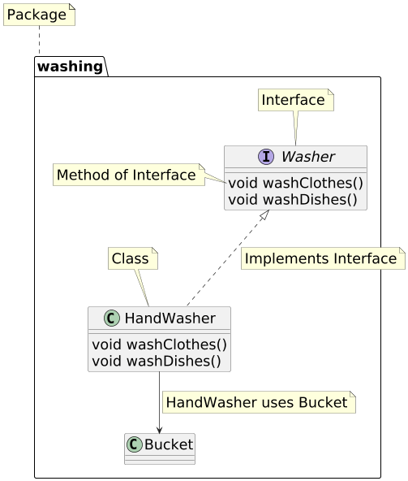
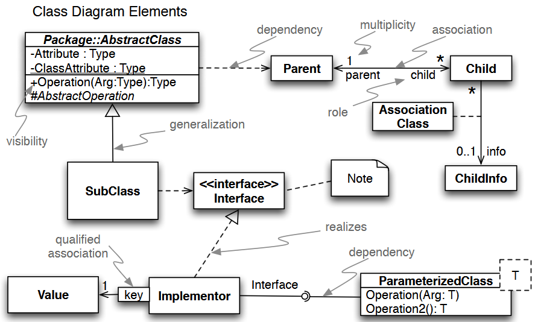

UML Basics
==========

UML
---

**U**nified **M**odeling **L**anguage

* Ein *Standard* um beispielsweise Teile einer Software zu visualisieren.
* Einlesen lohnt sich.
* Achtung: Tools nutzen manchmal eine abweichende Darstellungsweise.

Spezifikation: [UML: ISO/IEC 19501]

CheatSheets:

* [UML ClassDiagramm CheatSheet]
* [UML Full CheatSheet]

UML Klassendiagramm Beispiel
----------------------------

\colBegin{0.5}

\colNext{0.1}
\colNext{0.4}

Python Implementation: [class-diagram-parts.py](code/slides/uml/class-diagram-parts.py)

\colEnd

UML Klassendiagramm CheatSheet
------------------------------

