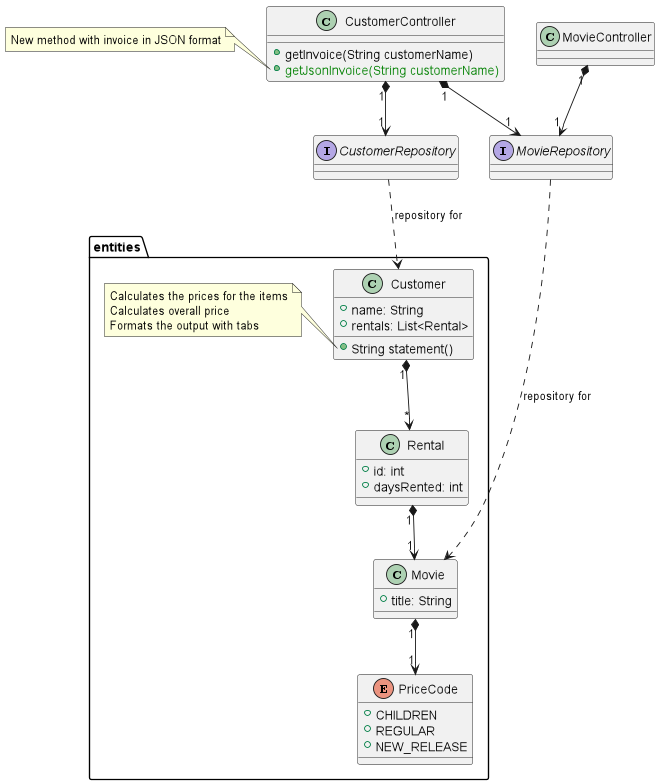
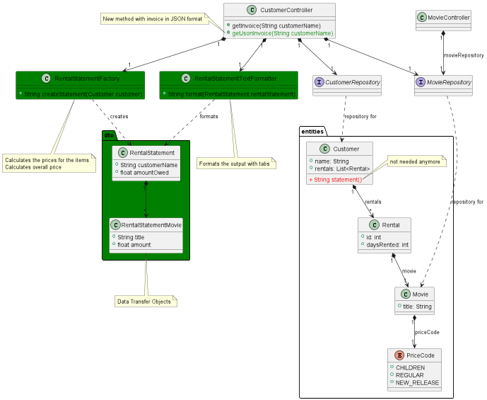

<#include meta/exercise.md>

---
author: Lucius Bachmann
title: "Arbeitsblatt: Zusätzliche Übungen für Testing"
---

Zusätzliche Übungen für Testing
===================================

MovieRental Teil 1: Refactoring mit TDD
--------

In dieser Übung geht es um einen Videoverleih. Im Laden sind verschiedene Filme, abgebildet durch die Klasse Movie,
verfügbar. Ein:e Kunde:in (Customer) kann einen Film (abgebildet durch Rental) für ein oder mehrere Tage
ausleihen.
Es gibt für die Filme verschiedene Preiskategorien (PriceCode). Für die Kunden:innen möchtest du eine Übersicht
über die momentan offenen Beträge drucken. Auf diese Funktionalität kannst du mit dem CustomerController zugreifen.
Du kannst das ganze auch interaktiv ausprobieren. Wenn du `JumpstartApplication::main` ausführst, dann ist auf
[http://localhost:8080/swagger-ui.html](http://localhost:8080/swagger-ui.html) ein simples ui, mit dem du Filme,
Kunden:innen und Ausleihungen erfassen und die Quittung ausgeben kannst. (Das UI verwendet die Lösung als Implementation).

Leider ist die Funktionalität für den Belegdruck in der Entity Customer implementiert. Weiter ist die Logik für
die Preisberechnung vermischt mit der Formatierung des Textes für den Beleg. Der Beleg soll jetzt auch
als JSON zur Verfügung gestellt werden, damit es mit einem WebFrontend dargestellt werden kann. Das Interface
für das WebFrontend ist schon definiert, siehe `CustomerController::getJsonInvoice` und `RentalStatement`.
Um Daten als JSON zu serialisieren, verwenden wir in Java Libraries. So können wir einfach eine Klasse definieren,
und die Library (In diesem Fall Spring zusammen mit Jackson) konvertiert diese Klasse automatisch in JSON.

In dieser Übung wirst du geführt zuerst die bestehende Funktionalität unter Test bringen und dann auslagern,
um die zusätzlich gewünschte Funktionalität zu implementieren. Für diese Übung verwenden wir TDD, d.h. es werden
nur Repositories (die Datenbank) gemockt.

<!-- markdownlint-disable -->
| Situation | | Ziel |
:-------------------------:|:-------------------------: |:-------------------------:
| {width=45%} | | {width=45%} |
<!-- markdownlint-enable -->

### Funktionalität unter Test bringen

Vervollständige die Tests in CustomerControllerTest, so dass die Code Coverage in
CustomerController und Customer fast 100% beträgt.
(Bis auf die Methode `CustomerController::getJsonInvoice` ist alles getestet.)
Die Code Coverage kann mit folgendem Befehl aktualisiert werden:

```bash
package='ch.scs.jumpstart.movierental.exercise'
mvn -f topics/testing/code/ '-Dtest='$package'.**.*Test' test
```

### Verschieben des Aufrufs

Der Code für die Preisberechnung und Formatierung ist momentan in der Entity. Entities sollen aber keine Logik
enthalten. Wir wollen die Funktionalität schlussendlich auf die beiden Klassen `RentalStatementFactory` und
`RentalStatementTextFormatter` aufteilen. Dabei wollen wir bei jedem Schritt die Testabdeckung behalten oder sogar
erweitern.  
Implementiere die Funktionalität von `RentalStatementFactory` mit `return customer.statement()`. Übergib dann die Klasse
`RentalStatementFactory` im Konstruktor der Klasse `CustomerController`.  
Ändere dann die Methode `CustomerController::getInvoice`: statt direkt `customer.statement()`
aufzurufen, rufe `RentalStatementFactory::createStatement` auf.  
Lasse den `CustomerControllerTest` laufen. Sind die nötigen Pfade abgedeckt?

### Inline von `Customer::statement`

Jetzt kannst du mit Test Coverage die Methode `RentalStatementFactory::createStatement` umbauen.
Wir fangen an, indem wir die Methode `Customer.statement()` inlinen\
(IntelliJ: `Ctrl + Alt + N`, VSCode: `Ctrl + .` $\rightarrow$ Inline Method).\
Dies ist ein von der IDE unterstütztes Refactoring, somit sollte
die Funktionalität nicht ändern. Aber du überprüfst das natürlich, indem du
die Tests laufen lässt. Wir haben jetzt eine neue Klasse mit Funktionalität, aber ohne Unittests. Um die Klasse
`RentalStatementFactory` später refactoren zu können, müssen wir sie auch wieder unter Test bringen. Auch bei TDD
sollte man die Klassen nicht indirekt (z.b. über den `CustomerControllerTest`) testen.  
Schreibe den Unittest für die Klasse `RentalStatementFactory`

### Refactoring von `RentalStatementFactory::createStatement`

Jetzt kannst du die beiden Concerns (Preisberechnung und Formatierung) innerhalb der Methode trennen.
Um die Preisberechnung zu speichern, kannst du schon die Klassen `RentalStatement` und `RentalStatementMovie` verwenden.
Lasse wie immer danach die Tests laufen.

### Extrahieren der Formatierung

Jetzt extrahieren wir den Formatierungsteil aus der Klasse `RentalStatementFactory` in die Klasse
`RentalStatementTextFormatter`. In einem ersten Schritt verwenden wir aber noch `RentalStatementTextFormatter` in der
Klasse `RentalStatementFactory`, damit wir die Unittests von `RentalStatementFactory` noch verwenden können.
Verschiebe die Formatierungslogik von `RentalStatementFactory` in `RentalStatementTextFormatter`, und übergib die Klasse
`RentalStatementTextFormatter` im Konstruktor der Klasse `RentalStatementFactory`. Rufe dann in
`RentalStatementFactory::createStatement` `RentalStatementTextFormatter::format` auf. Jetzt haben wir wieder eine neue
Klasse ohne Unittests. Schreibe Unitests für die Klasse `RentalStatementTextFormatter`. Um dir das Leben einfacher zu
machen, ist schon der `RentalStatementBuilder` vorbereitet. Die Tests für `RentalStatementTextFormatter` sind jetzt
einfacher zu schreiben, da du dir nicht mehr um die Preisberechnung Gedanken machen musst.
Du gibst ein paar Strings und Floats als Input, und überprüfst, dass Newlines und Tabs richtig dazwischen gesetzt
werden.

### Ändern des Interfaces von `RentalStatementFactory`

Wir wollen ja das `RentalStatement` selbst auch auf der API ausgeben können. Deshalb wollen wir, dass
`RentalStatementFactory::createStatement` ein `RentalStatement` zurückgibt. Dann können wir selber im Caller
(`CustomerController`) entscheiden, ob wir das noch formatieren wollen.
Dazu musst du folgendes machen:

1. Entferne den Aufruf von `RentalStatementTextFormatter::format` aus  
   `RentalStatementFactory::createStatement`
1. Das Interface ändert sich, also musst du jetzt die Tests von `RentalStatementFactory` anpassen.
1. In `RentalStatementFactory` brauchst du jetzt keinen `RentalStatementTextFormatter` mehr, du kannst ihn als Konstruktor
   Parameter entfernen.
1. CustomerController braucht jetzt aber `RentalStatementTextFormatter`, füge ihn deshalb hier als Konstruktor Parameter
   hinzu.
1. Ändere den Code in `CustomerController::getInvoice` so, dass du zuerst das `RentalStatement` mit
   `RentalStatementFactory::createStatement` erzeugst, und dann dieses mit `RentalStatementTextFormatter::format`
   formatierst. Jetzt sollte alles wieder kompilieren und alle Tests grün sein.

### Implementieren von `CustomerController::getJsonInvoice`

Implementiere jetzt den Test `CustomerControllerTest::return_json_invoice` und die Methode
`CustomerController::getJsonInvoice`.

### Refactoring der Tests

Jetzt musst du in `CustomerControllerTest` nicht mehr alle Fälle für die Formatierung beachten.
Hier brauchst du die beiden notFound Tests für die `getInvoice` Methode plus einen Erfolgsfall.
Die Spezialfälle für die Preisberechnung kannst du jetzt in `RentalStatementFactoryTest` testen. Die Spezialfälle
für die Formatierung gehören in `RentalStatementTextFormatterTest`. Plus du hast die zusätzliche Funktionalität
implementiert. Überlege, welche Tests du jetzt verschieben/löschen kannst, und mache das dann.


MovieRental Teil 2: Integrationstests
--------

Jetzt geht es darum, für die MovieRental Funktionalität einen Integrationstest zu schreiben.
Die erste Frage, die man sich stellen muss: Was möchte ich im Integrationstest testen, was im Unittest?
In dieser Übung ist die Frage schon für dich beantwortet, wir diskutieren am Ende noch zusammen,
ob die Aufteilung sinnvoll war. Ignoriere hier mal die Spring Magic, sondern copy paste die Verwendung
von WebTestClient und passie sie wenn nötig an.

### Implementieren der Tests

Implementiere die momentan leeren Tests in `SpringCustomerControllerIT`.
Es kann sein, dass dann ein Test fehlschlägt, weil Daten von einem vorherigen Test noch in der Datenbank sind.
Stelle sicher, dass vor oder nach jedem Test ein definierter Stand in der Datenbank ist.

### Zusatzaufgabe Aufteilung Integrationstest/Unittest

Überlege dir, welchen Teil der Funktionalität du mit einem Integrationstest, welchen du mit einem Unittest getestet
hättest. Bist du mit der Lösung einverstanden?

### Zusatzaufgabe Ungültiger Request

Schreibe einen Test, bei dem du ein ungültiges JSON an einen POST Endpoint sendest.
Welchen HTTP Statuscode erwartest du, welcher kommt zurück?
Finde mit einer Suchmaschine heraus, wie du den erwarteten HTTP Status Code zurückgeben kannst.
Frameworks und Libraries sind super, man muss sie aber auch richtig verwenden. Und manchmal verhalten sie sich
in gewissen Edge Cases anders, als du dir das wünschst. Deshalb sind Integrationstests wichtig, bei denen man die
Library/das Framework auch testet.
