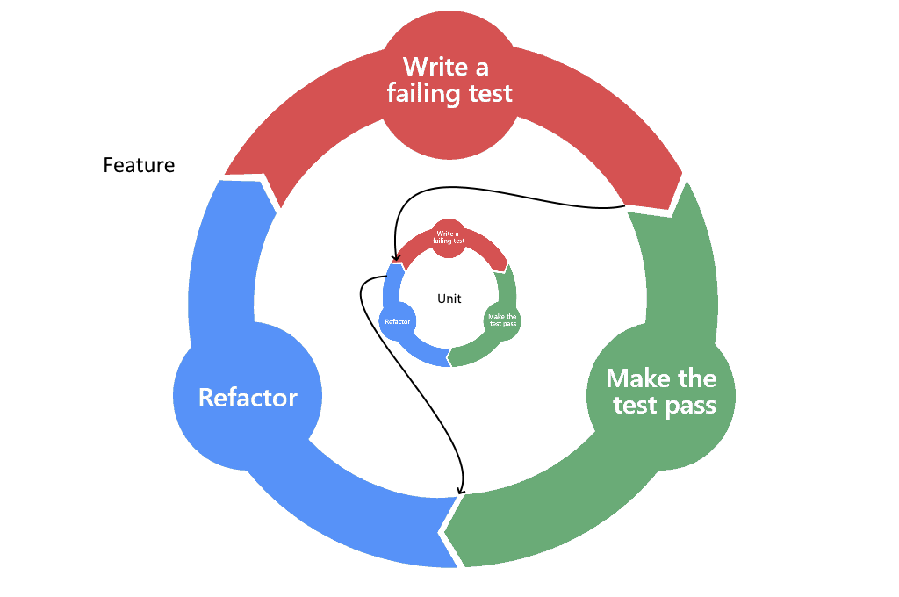

<#include meta/slides.md>

Testing
==============

Ziel
-------

* Du hast für eine Applikation Unittests, Integrationstests und Systemtests geschrieben
* Du kannst TDD und BDD anwenden, und kennst die Unterschiede
* Du kennst die Unterschiede zwischen Unittest, Integrationstest und Systemtest
* Du kennst folgende Techniken, um Tests wartbarer zu gestalten:
  * Setup/Teardown für Tests
  * Parametrisierte Tests
  * Enclosed Tests
  * Testdatenbank

Was helfen einem Tests?
-------

* Feedback Cycle kurz halten
* Reproduzierbare Resultate
* Dokumentation
  * des Interfaces
  * des Requirements
* Reduziert (bis zu eliminiert) manuelle Regressionstests
* Ermöglicht kürzere Release/Deployment Cycles
* Erhöht die Zuversicht nach Änderungen
* Features "schützen"
* Hilft beim Design
  * Unittests sagen nicht, dass ein Design gut ist
  * Aber nicht testbares Design ist sicher schlecht
* Je mehr Code automatisiert ausgeführt wird, desto besser

TDD
-------

* Alias Detroit/Chicago School, Classicist Approach
* Test from inside out
* Avoid Mocks

Ablauf:

1. Test schreiben
1. Klasse schreiben, damit der Test kompiliert und passed
1. Refactor
1. Weiteren Test schreiben
1. Klasse erweitern, damit der Test durchkommt
1. Refactor, falls die Klasse jetzt zu gross ist, zusätzliche Klassen extrahieren

Red Green Refactor
-------

Definition Unittest TDD
-------

* Setup ist günstig
* Verwendet keine shared Ressourcen (Datenbanken, Ports, Filesystem)  
Ausser natürlich Memory und CPU
* Testet eine Unit (Klasse in OO, Funktion in FP)  
Dependencies wurden schon von anderen Unittest getestet.
* Rule of Thumb: Laufzeit < 1s

Demo Unittest einer Funktion
-------

Übung Unittest einer Funktion
-------

Übung Mob Review
------

* Ziel: bessere Code Qualität
* Verschiedene Level
  * Design + Naming
  * Funktionalität
  * Konsistenz
  * Best Practices
  * Typos
  * Lesbarkeit erhöhen

Übung TDD mit mehreren Klassen
-------

Übung Mob Review 2
------

Parametrized Tests Demo
-------

Übung Parametrized Test
-------

Übung async Peer Review
------

Parametrized Tests in anderen Sprachen: PHP + PHPUnit
-------

\lstinputlisting[language=PHP, firstline=228, lastline=252, basicstyle=\tiny]{assets/CampCollaborationTest.php}

Parametrized Tests in anderen Sprachen: JavaScript + Jest 1
-------

\lstinputlisting[language=C, firstline=17, lastline=44, basicstyle=\tiny]{assets/EDatePicker.spec.js}

Parametrized Tests in anderen Sprachen: JavaScript + Jest 2
-------

\lstinputlisting[language=C, firstline=45, lastline=70, basicstyle=\tiny]{assets/EDatePicker.spec.js}

BDD
-------

* Alias London School, Mockist Approach
* From Outside in
* Interaktion zwischen Units werden getestet

Ablauf:

1. Zuerst wird der Test für das Szenario geschrieben
1. Damit der kompiliert, müssen die Klassen/Methoden der Dependencies erstellt werden
1. Dann werden für die Dependencies Tests geschrieben
1. Damit diese kompilieren, müssen wieder Klassen/Methoden der Dependencies erstellt werden
1. Sobald man bei allen Klassen angekommen ist, die keine Dependencies mehr haben fängt man mit der Implementation an
1. Sobald man alle Tests der Units für eine übergeordnete Komponente geschrieben hat,
sollte der übergeordnete Test grün werden.
1. repeat

Definition Unittest BDD
-------

* Setup ist günstig
* Verwendet keine shared Ressourcen (Datenbanken, Ports, Filesystem)  
Ausser natürlich Memory und CPU
* Testet eine Unit (Klasse in OO, Funktion in FP)  
*Dependencies werden gemockt.*
* Rule of Thumb: Laufzeit < 1s

Red Green Refactor on steroids
-------

Demo Test Klasse mit State
-------

Weitere Helper für Tests
-------

* Konstanten
* Builder
* Matcher
* Hilfsmethoden (use with caution)

Übung Test Klasse mit State
-------

Übung sync Peer Review
------

Enclosed Tests Demo
-------

Übung Enclosed Tests
-------

Übung async Peer Review
------

Enclosed Tests in anderen Sprachen
-------
TODO: nur falls ich beispiele finde

Integrationtest
-------

* Ziel: Die Haupt Features der Komponenten funktionieren funktionieren auch mit DB, Filesystem oder Socket's
* Es werden nicht mehr alle Fehlerfälle der Subkomponenten getestet
* Abwägen zwischen Laufzeit und Testabdeckung

Demo Integrationtest
-------

Fixtures
-------

* Weniger noise im Testcode
* Durch Fixtures entstehen Abhängigkeiten zwischen den Tests

Beispiel:
TODO: Anpassung Email im Test in Ecamp
TODO: Hinzufügen von zweitem Lager für einen Test
TODO: Rega TestdatabaseSetup

Übung Integrationstest
-------

Übung async Peer Review
------

Systemtests
-------

* Noch weniger Details als beim Integrationstest werden getestet
* Das ganze System wird möglichst wie in Produktion Hochgefahren
  * Richtiges DBMS
  * Echte Web Requests
* Es können auch mehrere Systemteile (z.b. unterschiedliche Services)  
hochgefahren werden.
* Lokale Ausführung oft nicht mehr möglich
  

Übung Systemtest
-------

Übung async Peer Review
------

Demo Systemtest
-------
